# Google Cybersecurity Certificate - Course Notes

## ✅ Course 1 - Foundations of Cybersecurity

**What I learned**
- Learned the core purpose of cybersecurity: protecting systems, networks, and data from unauthorized access and attacks.
- Built familiarity with the CIA Triad: confidentiality, integrity, and availability.
- Reviewed major threat actors such as cybercriminals, nation-states, insiders, and hacktivists.
- Introduced to major security frameworks, including NIST CSF, and why organizations use them to manage risk.
- Learned how social engineering, phishing, and malware fit into the broader threat landscape.

**Why this matters**
This course built the base for understanding how organizations think about security, risk, and attacker behavior.


## ✅ Course 2 - Play It Safe: Manage Security Risks 

**What I learned**
- Studied the NIST CSF five functions: Identify, Protect, Detect, Respond, and Recover.
- Learned basic risk management concepts, including how to identify, assess, and prioritize risk.
- Reviewed the role of audits, compliance, and security policies in organizations.
- Learned how SIEM tools help collect and analyze logs for threat detection.
- Practiced understanding how SOC analysts use playbooks and incident response workflows.

**Why this matters**
This course introduced the mindset and structure behind how security teams manage threats and respond to incidents.


## ✅ Course 3 - Connect and Protect: Networks and Security 

**What I learned**
- Learned how networks function, including LAN, WAN, and how devices communicate across layers.
- Built a foundation in the TCP/IP model and common protocols such as TCP, UDP, HTTP, HTTPS, DNS, and FTP.
- Learned basic IP addressing concepts, including IPv4 and IPv6.
- Explored common security tools like firewalls, IDS, IPS, and VPNs.
- Reviewed common network attacks such as DDoS, packet sniffing, and man-in-the-middle attacks.
- Learned why patching and closing unnecessary ports are important for network hardening.

**Why this matters**
This course gave me the networking foundation needed to understand traffic, threats, and security controls in real environments.


## ✅ Course 4 - Tools of the Trade: Linux and SQL 

Key Skills: Linux administration, file management, permissions, user management, SQL querying

**Linux Package Management**
- In this lab I installed Suricata (a network security monitoring tool) using apt package manager, verified successful deployment, then cleanly removed it.


What this shows: Ability to deploy and manage security tools in Linux enviornments.

**Linux File System Navigation & Analysis**
- Navigated directories using pwd, ls, cd, cat. I also used grep with piping (|) to search server logs for "error" patterns. 


What this shows: Log analysis skills critical for SOC analysts investigating incidents. 

**File & Directory Management**
- This lab I created/removed directories (mkdir/rmdir), moved files (mv), deleted files (rm), created files (touch), and edited files with nano. 


**File permissions & Access Control**
- Viewed permissions of files (ls -l/ls -la), modified with chmod o-w to enforce least privilege, and managed hidden files.


What this shows: Understanding of access control fundamental to sysadmin/SOC roles. 

**User & Group Management**
- Practiced creating users (sudo useradd), assigned the user with primary/secondary groups (usermod -g), changed ownership (chown), and handled group deletion issues.


What this shows: Practical Active Directory/Linux admin skills.

**SQL Database Querying**
- This lab I practiced with SQL by querying login attempts using SELECT, WHERE, ORDER BY, BETWEEN, AND/OR/NOT, and using INNER/LEFT/RIGHT JOINs.


What this shows: Log analysis and investigation skills used in SIEM platforms. 

**Tools Used/Practiced With**
- Bash shell (CLI navigation, grep, piping)
- Package management (apt)
- Text editors (nano)
- File permissions (chmod, chown)
- User management (useradd, usermod, groupdel1)
- SQL (SELECT, WHERE, LIKE, ORDER BY, JOINs)
- Suricata IDS (installation/testing)


## ✅ Course 5 - Assets, Threats and Vulnerabilities 

Key Skills: Risk assessment, cryptography, threat analysis, vulnerability management

**Asset Management & Risk Analysis**
- Classified assets by sensitivity (Restricted/Internal/Public) and data states (Use/Transit/Rest).
- Built risk register scoring bank's funds using Likelihood x Severity matrix.
- Condicted home asset inventory to map personal attack surface.

**Linux Cryptography Labs**
SHA-256 File Integrity Verification
- Generated file hashes with sha256sum, compared to detecting tampering which is a core SOC analyst skill for malware detection. 


**File Decryption & Analysis**
- Used the tr command for text translation and openssl for decryption, revealing hidden messages in encrypted files. 


What this shows: Command-line handling of encrypted data during investigations

**Real-World Threat Scenarios**
- Reviewed a data leak incident where a sales representative accidentally shared a link to an internal folder with a business partner who then posted it publicly on social media. Applied NIST SP 800-53 AC-6 guidance on least privilege and recommended restricting access to sensitive resources based on user role and regularly auditing user privileges to prevent similar exposure.

**Parking Lot USB Exercise**
- Analyzed a scenario where a hospital employee named Jorge found a USB drive in a parking lot and plugged it in. The drive contained personal and work files including PII of coworkers and hospital operational data. Identified how an attacker could use this information to craft targeted phishing emails impersonating coworkers or relatives. Recommended managerial controls like employee awareness training, operational controls like routine antivirus scans, and technical controls like disabling AutoPlay on company computers to prevent automatic execution of malicious code.


**Playbook Incident Documentation**
- Used a security playbook to document a simulated incident, following 
structured steps to record what happened, who was involved, and what 
actions were taken in response. This mirrors the real workflow a Tier 1 
SOC analyst follows when triaging and responding to alerts.

**Phishing Email Triage**
- Identified red flags: domain mismatch, urgent language, suspicious links, credential requests. 

**Security Concepts Mastered**
- Asset classification & data lifecycle
- Risk = Likelihood × Severity scoring
- SHA-256 integrity verification
- Symmetric/asymmetric encryption (PKI)
- OWASP Top 10 (injection, XSS, broken access control)
- Social engineering lifecycle (prepare/trust/persuade/disconnect)
- Malware taxonomy (11 types including fileless/rootkits)
- Defense in depth (5 layers)
- Threat modeling (PASTA, attack trees)

## ✅ Course 6 - Detection & Response

Key Skills: Packet analysis, SIEM workflow, IDS rules, incident triage, log analysis

**What I Built & Practiced**
Packet Analysis Lab - Wireshark Traffic Investigation
- In this Wireshark lab I analyzed website browsing PCAP: filtered DNS (udp.port == 53), TCP streams, inspected IPv4 headers (source.dest IPs, TTL, protocol).

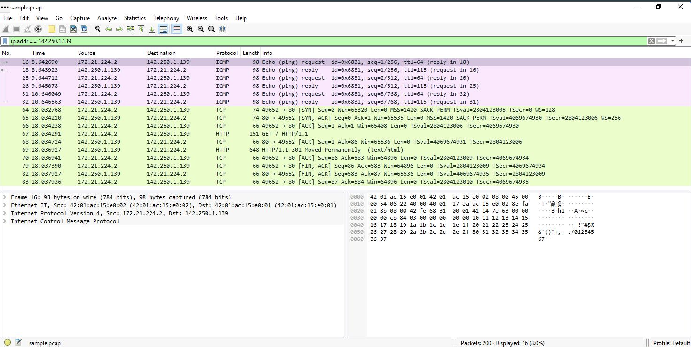
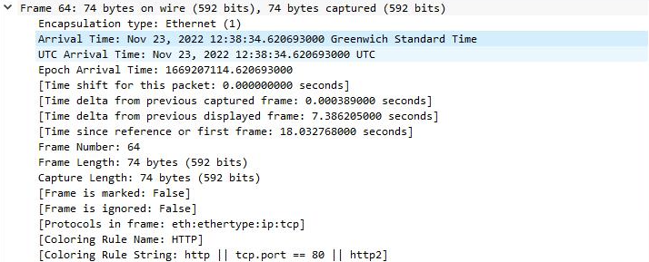
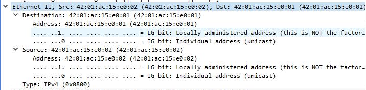
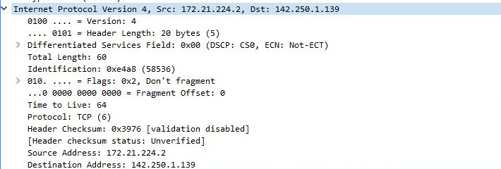
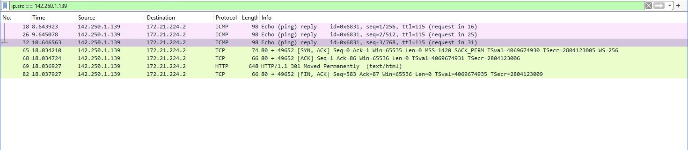
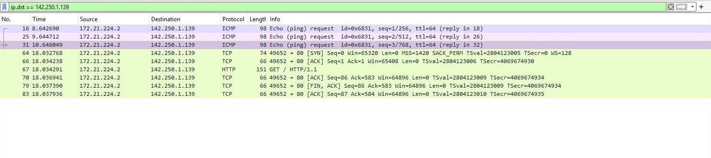
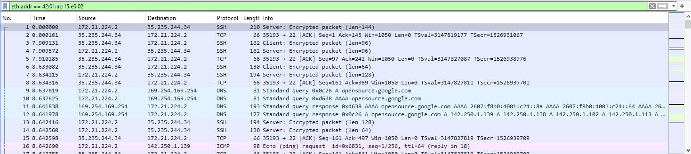
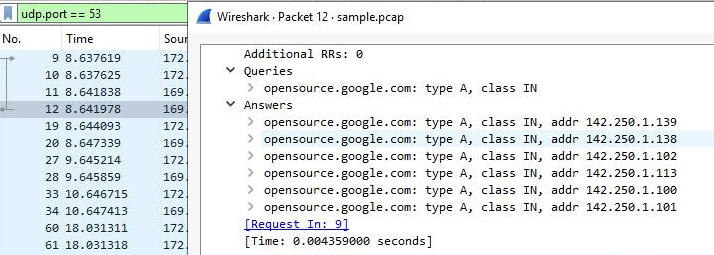

What this shows: Core SOC skill for investigating network-based alerts.

**tcpdump Live Capture**
- In the Linux terminal I captured Linux traffic, identified interfaces (-i eth0), saved PCAPs (-w), filtered by port/host (port 80, host 192.168.1.1).

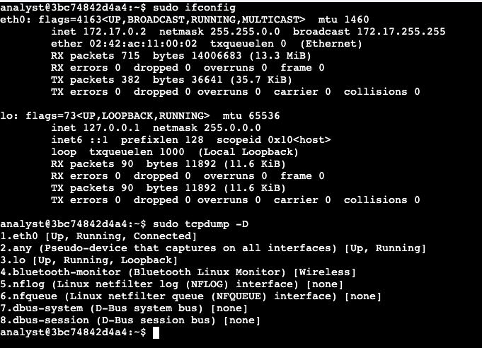
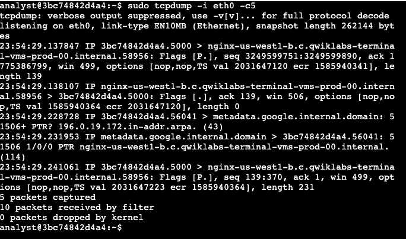
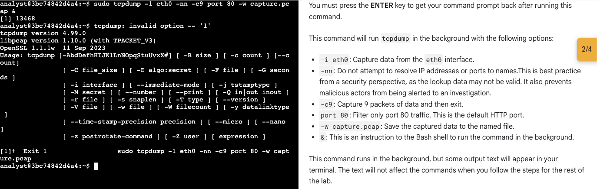
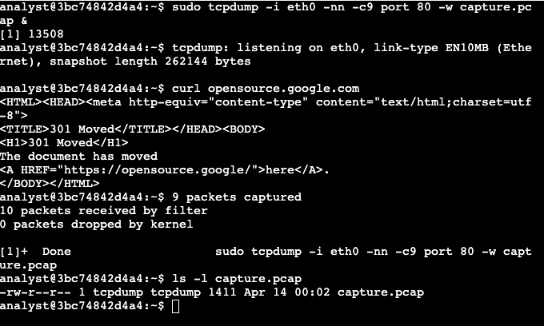

**IDS Rules & Log Analysis**
Suricata Custom Rule Testing
- Wrote/tested custome detection rules against sample.pcap. Analyzed fast.log (alert summary) and eve.json (detailed telemtry)

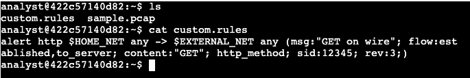
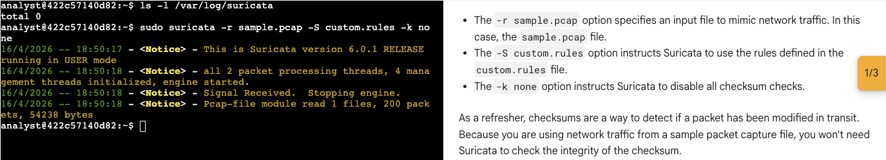
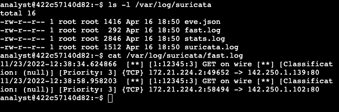
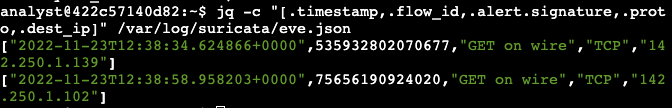

What this shows: Rule creation and log interpretation for threat hunting. 

**Advanced SOC Concepts Practiced**
- SIEM workflow (collect/normalize/analyze)
- Packet structure (header/payload/footer)
- Wireshark filters (ip.addr==, udp.port==53, http contains)
- tcpdump syntax (-i, -w, -c, port, host)
- IDS rule anatomy (action/header/options)
- Suricata logs (fast.log, eve.json)
- Threat hunting vs reactive monitoring
- Chain of custody documentation
- TTPs analysis
- False/true positive triage

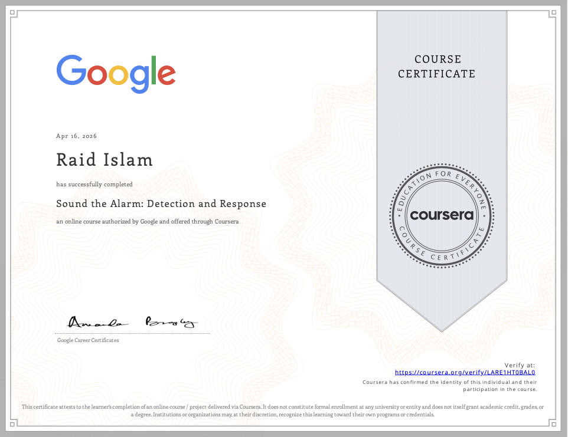

## ✅ Course 7 - Automate Cybersecurity Tasks with Python

**Key Skills:** File I/O automation, regex log parsing, IP allow/block lists, access control algorithms, production sysadmin scripting

**What I Learned**
- Python fundamentals: variables, lists, functions, loops, conditionals
- File handling (`with` statements, read/write/verify)
- Regular expressions for log parsing
- List manipulation and automation algorithms
- Debugging production scripts

### 1. Access Control Algorithm (User + Device Validation)
**Task:** In the lab the task was to practice building a security gatekeeper validating username against approved list AND matching device ID.

**Code:**
```python
approved_users = ["elarson", "bmoreno", "sgilmore", "eraab", "gesparza"]
approved_devices = ["8rp2k75", "hl0s5o1", "4n482ts", "a307vir", "3rcv4w6"]
username = "sgilmore"
device_id = "4n482ts"
ind = approved_users.index(username)

if username in approved_users and device_id == approved_devices[ind]:
    print("The user", username, "is approved to access the system.")
    print(device_id, "is the assigned device for", username)
elif username in approved_users and device_id != approved_devices[ind]:
    print("The user", username, "is approved but", device_id, "is not their device.")
```

**What this shows:** This shows multi-factor validation (user + device) before network access. Scales to MFA, endpoint verification.

### 2. IP Threat Hunting (Regex Log Parsing + Flagged Lists) ⭐
**Task:** The task for this lab was to parse messy authentication logs → extract IPs with regex → flag known bad actors.

**Code:**
```python
import re
log_file = "eraab 2022-05-10 6:03:41 192.168.152.148 \\niuduike..."
pattern = "\\d{1,3}\\.\\d{1,3}\\.\\d{1,3}\\.\\d{1,3}"
valid_ip_addresses = re.findall(pattern, log_file)
flagged_addresses = ["192.168.190.178", "192.168.96.200", "192.168.174.117"]

for address in valid_ip_addresses:
    if address in flagged_addresses:
        print("FLAGGED:", address, "→ Further analysis required")
    else:
        print("CLEAN:", address)
```

**What this shows:** SIEM log ingestion → automated threat hunting → alert triage workflow.

### 3. IP Allow List Management (Production File Automation) ⭐
**Task:** In this lab the task was to make a script to read IP allow list → surgically remove compromised IPs → rewrite production file.

**Code:**
```python
def update_file(import_file, remove_list):
    # Read → Parse → Clean → Write
    with open(import_file, "r") as file:
        ip_addresses = file.read().split()
    for bad_ip in remove_list:
        if bad_ip in ip_addresses:
            ip_addresses.remove(bad_ip)
    with open(import_file, "w") as file:
        file.write(" ".join(ip_addresses))

update_file("allow_list.txt", ["192.168.25.60", "192.168.140.81", "192.168.203.198"])
```

**What this shows:** Incident response automation (revoke attacker IPs from firewall during breach).

### 4. File I/O Pipeline (Create → Read → Verify)
**Task:** The task for this lab was to build an algorithim to create + verify production allow list files.

**Code:**
```python
import_file = "data/allow_list.txt"
ip_addresses = "192.168.218.160 192.168.97.225 192.168.145.158..."

# WRITE production file
with open(import_file, "w") as file:
    file.write(ip_addresses)

# READ + verify
with open(import_file, "r") as file:
    text = file.read()
print(text)  # Confirmed persistence
```

**What this shows:** Complete file lifecycle automation for sysadmin workflows.

## **SOC/SysAdmin Impact**
Built complete automation pipeline: **Log parsing → Threat hunting → Allow list management → File persistence**. Ready for Splunk/ELK integration, firewall automation, endpoint management.

**Tools Mastered:** Python 3.x, regex, file I/O, list algorithms, debugging

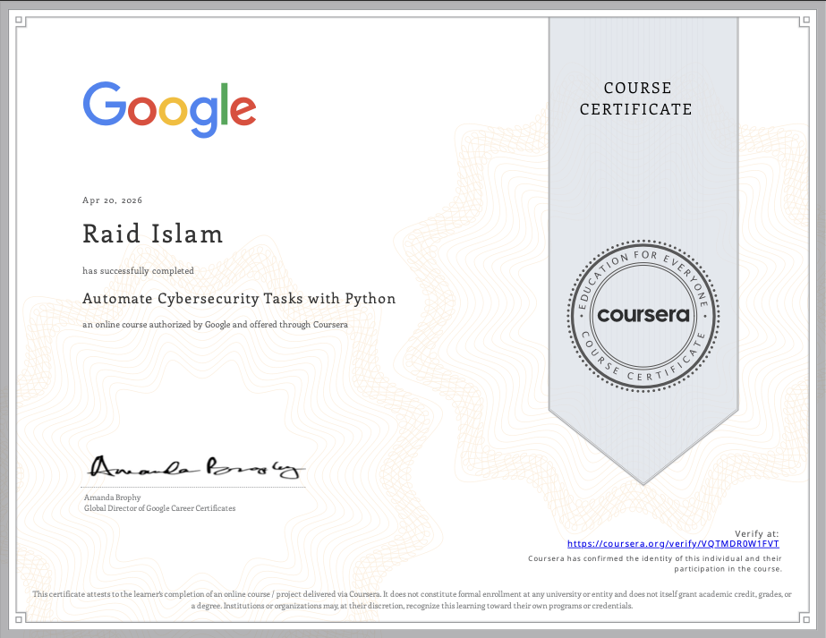

## ✅ Course 8 - Put It to Work: Prepare for Cybersecurity Jobs

Key Skills: Incident escalation, stakeholder communication, 
job search strategy, professional development

**What I Learned**

**Incident Escalation & Classification**
- Learned how SOC analysts classify incidents by severity and urgency 
to determine when to escalate to Tier 2 or higher
- Practiced identifying which incidents require immediate escalation 
versus which can be handled at Tier 1
- Reviewed how miscommunicating or failing to escalate an incident 
can directly impact an organization's security posture

What this shows: Understanding of SOC team structure and when to 
escalate — a critical judgment call for Tier 1 analysts that 
interviewers frequently ask about.

**Stakeholder Communication**
- Learned how to communicate security incidents clearly to both 
technical and non-technical stakeholders
- Practiced writing concise incident summaries that convey impact 
without unnecessary technical jargon
- Reviewed how effective communication during an incident reduces 
response time and minimizes damage

What this shows: Written and verbal communication skills are 
consistently ranked as one of the top qualities hiring managers 
look for in SOC analyst candidates alongside technical skills.

**Security Mindset & Professional Development**
- Reviewed how to engage with the security community through 
platforms like LinkedIn, security blogs, and industry publications
- Learned the importance of continuously updating knowledge as 
the threat landscape evolves
- Discussed the value of professional networks, mentorship, and 
staying current with tools like CISA advisories and threat feeds

What this shows: Demonstrates awareness that cybersecurity 
requires continuous learning beyond certifications and coursework.

**SOC Career Pathway**
- Reviewed the tiered SOC structure and how analysts progress 
from Tier 1 through Tier 3 into specialized roles like incident 
responder, threat hunter, and security engineer
- Learned what hiring managers look for in entry level SOC candidates 
including hands-on tool experience, certifications, and a documented 
portfolio of work
- Practiced preparing for cybersecurity interviews including how to 
discuss labs, projects, and technical experience confidently

What this shows: Clear understanding of where a Tier 1 SOC analyst 
role fits in a broader security career and how to present experience 
effectively to employers.

**Core Concepts Covered**
- Incident severity classification and escalation thresholds
- Stakeholder communication frameworks
- SOC tier structure (Tier 1 → Tier 2 → Tier 3)
- Professional development resources and security communities
- Interview preparation for entry level security roles

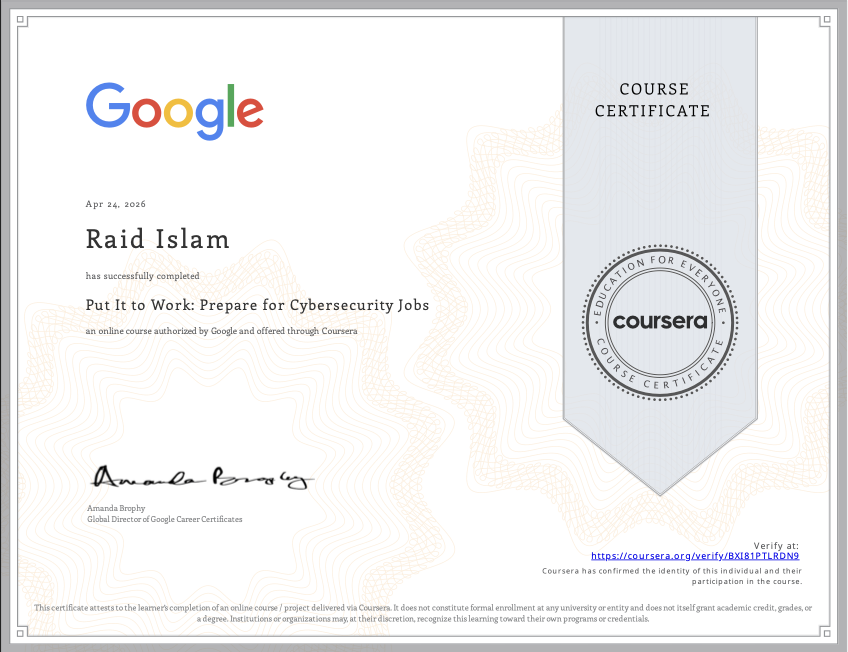

## ✅ Course 9 - AI in Cybersecurity Job Search & Career Development

Key Skills: AI-assisted job searching, resume optimization, 
interview preparation, professional development

**What I Learned**

**Using AI for Job Search**
- Learned how to use AI tools to identify relevant job postings 
and filter roles that match specific skills and experience levels
- Practiced using AI to research target companies, understand their 
security posture, and tailor applications accordingly
- Reviewed how AI can help identify keywords in job descriptions 
to optimize resume language for applicant tracking systems (ATS)

What this shows: Modern job search literacy — understanding how 
to use available tools efficiently is a practical skill employers 
value in candidates who need to stay current with evolving technology.

**AI-Assisted Resume Optimization**
- Learned how to use AI to align resume language with specific 
job descriptions without misrepresenting experience
- Practiced identifying gaps between a job posting's requirements 
and current skills to prioritize what to learn next
- Reviewed how ATS systems filter resumes before human review 
and how to ensure a resume passes automated screening

What this shows: Awareness of how modern hiring works end to end, 
from ATS filtering to human review, and how to position experience 
effectively at each stage.

**Interview Preparation with AI**
- Practiced using AI to generate likely interview questions based 
on specific job descriptions and then preparing structured answers
- Learned the STAR method (Situation, Task, Action, Result) for 
answering behavioral interview questions with concrete examples
- Reviewed how to prepare technical answers for common SOC analyst 
interview topics like explaining the triage process, describing 
how SIEM works, and walking through a past lab or project

What this shows: Structured interview preparation using available 
tools demonstrates initiative and seriousness about landing a role 
— qualities that stand out at the entry level.

**Core Concepts Covered**
- ATS (Applicant Tracking System) optimization
- AI-assisted job search and company research
- Resume tailoring to specific job descriptions
- STAR method for behavioral interview answers
- Technical interview preparation for SOC analyst roles

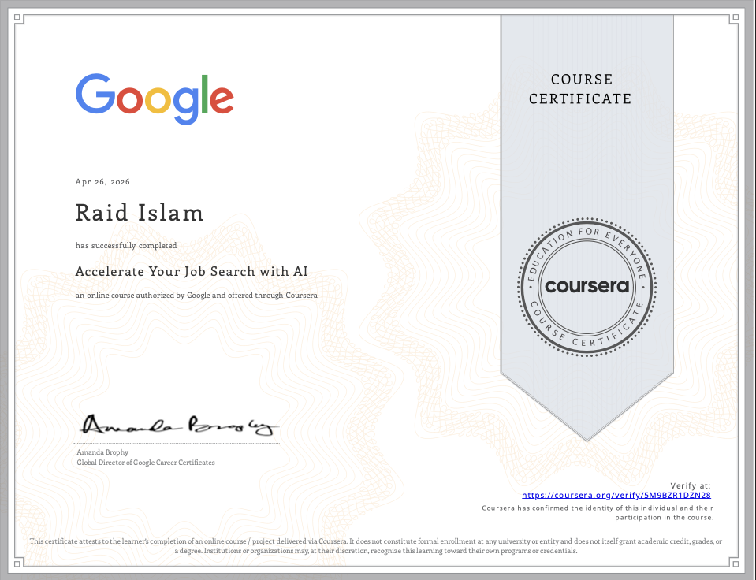

## Reflection

Completing the Google Cybersecurity Certificate marked my first major milestone toward a career in security operations. Across nine courses I built a foundation in network security, Linux administration, cryptography, threat detection, and incident response, and more importantly I documented the hands-on work to prove it.

This is the first of many steps for me in my journey, I will move onto TryHackMe, building a home SIEM lab,to start studying for my CompTIA Security+ certificate and IS2 CC cert. My goal is to gain even more valuable expierence so I can apply them and stregnthen them for future internships and jobs. I'm eager to dive deep into this field!

This repository will continue to grow as I do, more will come. 

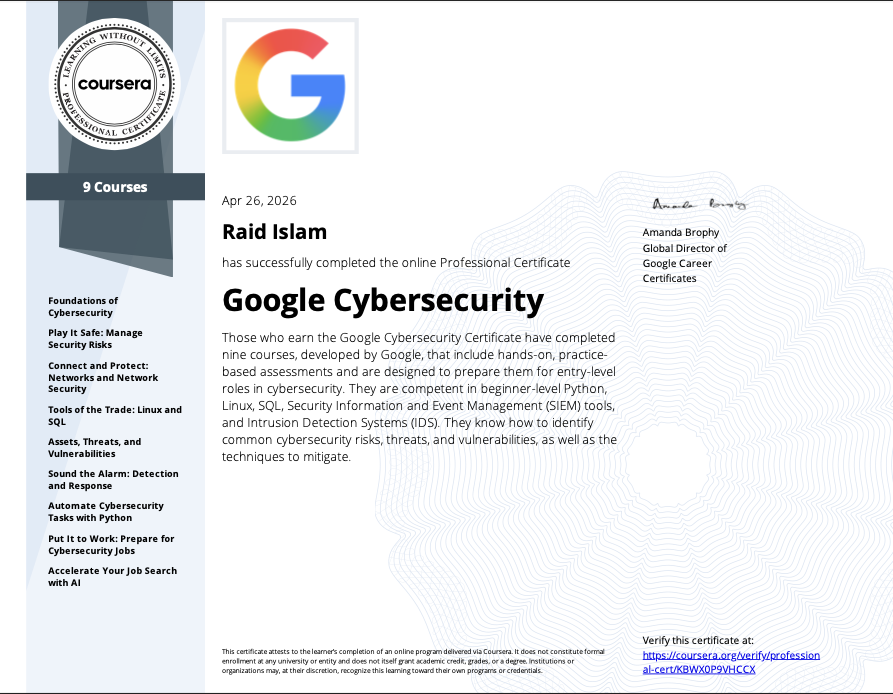
