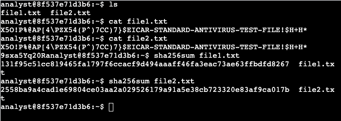
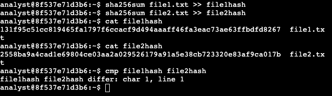
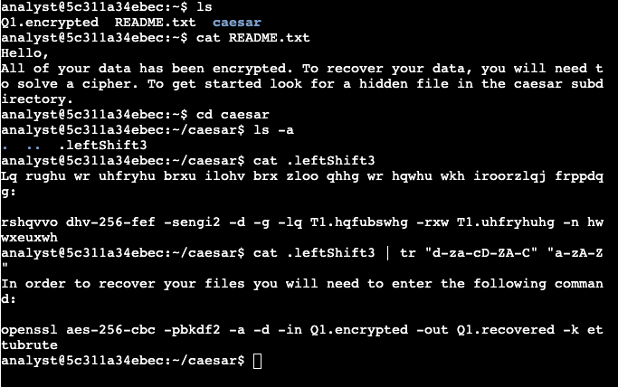
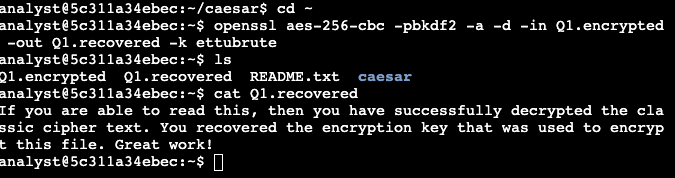
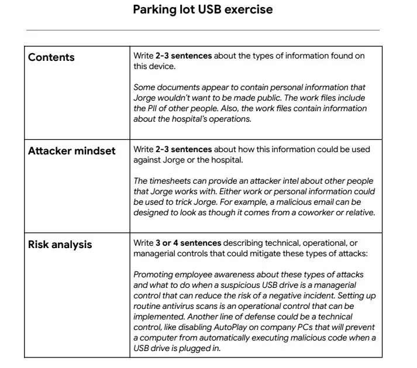

# Google Cybersecurity Certificate - Course Notes

## ✅ Course 1 - Foundations of Cybersecurity
### Key Concepts
- Cybersecurity is the practice of protecting networks, systems, and data from unauthorized access or attacks
- Introduced the eight CISSP security domains covering areas like asset security, identity management, and software development security
- Covered the history of cybersecurity including early viruses, the Morris Worm, and how attacks evolved over time
- Introduced the CIA Triad (Confidentiality, Integrity, Availability) as the core framework for security decisions
- Discussed types of threat actors including nation-states, cybercriminals, hacktivists, and insider threats
- Covered common attack types including phishing, malware, and social engineering
- Introduced security frameworks like NIST CSF and their role in managing organizational risk
- Emphasized that security is everyone's responsibility, not just the IT team

## ✅ Course 2 - Play It Safe: Manage Security Risks 
### Key Concepts
- Covered the NIST Cybersecurity Framework (CSF) five core functions: Identify, Protect, Detect, Respond, Recover
- Introduced risk management concepts including how to identify, assess, and prioritize risks
- Discussed security audits and their role in ensuring compliance with policies and regulations
- Covered common compliance frameworks including HIPAA, GDPR, and PCI-DSS and why organizations follow them
- Introduced SIEM tools as a way to collect and analyze security logs to detect threats
- Covered security playbooks and how SOC analysts use them to respond to incidents consistently
- Discussed the difference between threats, vulnerabilities, and risks and how they relate to each other
- Introduced basic incident response concepts including how analysts triage and prioritize security events

## ✅ Course 3 - Connect and Protect: Networks and Security 
### Key Concepts
- Covered how networks work including LAN, WAN, and the difference between them
- Introduced the TCP/IP model and how data travels across a network through layers
- Covered key networking protocols including TCP, UDP, HTTP, HTTPS, DNS, and FTP and what each does
- Discussed IP addressing including the difference between IPv4 and IPv6
- Introduced network security tools including firewalls, IDS, IPS, and how they protect network traffic
- Covered common network attacks including DDoS, packet sniffing, and man-in-the-middle attacks
- Discussed VPNs and how they encrypt traffic to protect data in transit
- Introduced the concept of network hardening including closing unnecessary ports and keeping systems patched

## ✅ Course 4 - Tools of the Trade: Linux and SQL 
### Key Concepts
- This course we go into learning and getting hands on expierence with the operating system
- The OS (operating system) we learn in this course is Linux, we learn the basic command lines in the bash shell

### Module 1 - Introduction to operating systems
- Learned about the different OS, like Windows, Linux, ChromeOS, Android, and IOS
- Also talked about how the user and computer interact with each other, it starts with the user then the application, then the OS, and then to the hardware. Once it reaches the hardware it goes into reverse order so the user gets that output
- Talked about GUI (Graphical User Interface) and CLI (Command Line Interface)

### Module 2 - The Linux operating system
- This module covered the architecture of Linux and how each layer interacts 
with the other. The structure goes from the user at the top, down through 
applications, the shell, the kernel, and finally the hardware. We also 
covered the Filesystem Hierarchy Standard (FHS) which defines how directories 
are organized in Linux.

**Lab 1 - Installing and Deleting**

- In our first hands-on lab we worked with the apt package manager to install 
and remove applications. We verified apt was installed, used it to install 
Suricata (a network security monitoring tool), confirmed the installation 
was successful, and then removed it afterwards.

**Lab 2 - Basic input commands in Linux**

- We then practiced basic input commands in the shell. The echo command prints 
text back to the terminal, and expr performs mathematical calculations. These 
are foundational commands for writing bash scripts later on.

### Module 3 - Linux commands in the Bash shell

**Lab 1 - Basic navigagtion**

- In this lab we practiced navigating the Linux file system using core commands. Used pwd to check the current directory, ls to list contents, and cd to move between directories. We also used cat to read file contents and practiced writing absolute paths from the home directory.

**Lab 2 - Filtering in Linux**

- We then covered filtering commands using grep to search for specific patterns inside files like finding the word "error" in server_logs.txt. Also used piping with the | symbol to chain commands together for more specific results.

**Lab 3 - Creating, removing, moving and editing files and directories**

- In this lab we created and removed directories using mkdir and rmdir, and moved files between directories using the mv command. We then deleted a file called tempnotes.txt using rm and created a new file called tasks.txt using touch.Finally we edited tasks.txt using the nano text editor and verified the changes were saved using cat.

**Lab 4 - File permissions and hidden files**

- In the next lab we worked with file permissions to control who has access to what. We used ls -l to view permissions on files inside the permissions directory, and ls -la to also reveal hidden files. After reviewing the permissions we used chmod to modify them, specifically using chmod o-w to remove the write permission from the owner on specific files.

**Lab 5 - User permissions and assigning**

- In the next lab of this module we managed users and groups. We created a new user called researcher9 using sudo useradd, then added them to the research_team group using sudo usermod -g. We assigned file ownership of project_r.txt to that user using chown, and added them to a secondary group called sales_team. When deleting the user with userdel ran into an issue since the user wasn't in a primary group, so we used groupdel instead to remove the group.

### Module 4 - Databases and SQL

**Lab 1 - SQL in Linux**

- In our first lab of this module we start getting some first expierence with using SQL queries. We use SELECT to retrieve the columns and then FROM to retrieve the date from the table. For this instance we are getting records of the login date and login time and then using ORDER BY to have those at the top. 

**Lab 2 - SQL filtering in databases**

- In this next lab we work with the WHERE and LIKE operator for more specific filtering in SQL databases. We use WHERE to pull specific columns from the specific table in SQL and we use the LIKE operator to type in a word with a percentage symbol to find a matching pattern. 

**Lab 3 - Times and dates in SQL**

- This lab we focused on finding data with dates and times, either using a less then, greater than, or even less than and equal too or greater than and equal too symbols to determine data either after or before those times and and dates. We also used the BETWEEN operator to find data inbetween two times or dates to pull even more specific data from the tables. 

**Lab 4 - Finding specific data in SQL**

- Next lab we use the operators AND, OR, and NOT to filter out stuff even more specific data we need to find. Like finding failed login attempts before a specific time and to see if it actually failed and how many attempts where there. Or finding a specific department with a specific office and even excluding a department. 

**Lab 5 - Joins in SQL**

- In this final lab we use 3 forms of joining tables, the INNER JOIN, RIGHT JOIN, and LEFT JOIN, this lab didn't include the FULL OUTER JOIN but it wasn't needed for the scenario. 

## ✅ Course 5 - Assets, Threats and Vulnerabilities 

### Module 1 - Asset Security

- This module covered asset management and why organizations need to identify 
and classify what they own before they can protect it. Assets can be physical 
(hardware, facilities) or digital (data, software).

**Asset Classification** labels assets by sensitivity:
- Restricted — Need-to-know only
- Confidential — Limited to specific users
- Internal-only — Users on-premises only
- Public — Anyone can access

**Data States** define where data exists at any given moment:
- Data in Use — actively being accessed or processed
- Data in Transit — moving across a network
- Data at Rest — stored and not currently being accessed

**Risk** is calculated by Likelihood x Severity to produce a priority score. 
A risk register is used to document and prioritize these risks.

**NIST CSF Core Functions:** Identify, Protect, Detect, Respond, Recover.
NIST Tiers measure cybersecurity maturity from Tier 1 (informal) to Tier 4 
(fully adaptive). Profiles represent the gap between current and target 
security posture.

**Activities:**
- Home Asset Inventory — classified home network devices by owner, access 
frequency, location, and sensitivity level to understand attack surface
- Risk Register — scored risks to a bank's funds asset by likelihood and 
severity using a risk matrix to determine priority

### Module 2 - Protect organizational assets

This module covered how organizations protect data privacy and security 
through controls, encryption, and authentication. 

**Types of Security Controls:**
- Technical — technology-based controls like encryption and firewalls
- Operational — day-to-day procedures like access reviews and monitoring
- Managerial — policies and governance that guide security decisions

**Data Lifecycle:** Collect → Store → Use → Archive → Destroy.
Each stage requires appropriate controls to protect data privacy.

**Key Definitions:**
- Data Custodian — responsible for the safe handling and storage of data
- Information Privacy — the right to control how personal data is collected and used
- Information Security — the practice of protecting data from unauthorized access
- Cryptography — the process of transforming readable data into an unreadable format to protect it
- Cipher — an algorithm used to encrypt and decrypt data
- Cryptographic Key — a value used by a cipher to encrypt or decrypt data

**Encryption Types:**
- Symmetric Encryption — uses the same key to encrypt and decrypt data, faster but less secure for sharing
- Asymmetric Encryption — uses a public key to encrypt and a private key to decrypt, more secure for sharing
- Public Key Infrastructure (PKI) — a two step process that manages the creation and distribution of digital certificates to verify identities online
- Digital Certificate — an electronic document that verifies the identity of a person, device, or organization online

**Hashing:**
Hash functions convert data into a fixed-length code called a hash value or 
digest that cannot be decrypted. Used to verify file integrity — if even one 
character changes, the hash value changes completely. Common algorithm: SHA-256.

**Authentication Factors:**
- Knowledge — something you know (password, PIN)
- Ownership — something you have (phone, token)
- Characteristic — something you are (fingerprint, face ID)

**Session Management:**
- Session — a period of network activity between a user and a server
- Session ID — a unique token assigned to identify a session
- Session Cookie — stores the session ID in the browser to maintain the session
- Session Hijacking — an attack where a threat actor steals a session cookie to impersonate a legitimate user

**Authentication Methods:**
- Basic Auth — username and password sent with each request, considered weak on its own
- API Token — a unique identifier used to authenticate access to an application or service
- MFA (Multi-Factor Authentication) — requires two or more authentication factors, significantly reduces unauthorized access risk

**Lab 1 - Hashing Files in Linux**
- In this lab we generated hash values for two files using the sha256sum command and manually compared them in the terminal to detect differences. This is similar to how SOC analysts verify file integrity to identify whether a file has been tampered with or replaced by a malicious program.

**Lab 2 - Decrypting Files in Linux** 
- This lab we used Linux commands including tr for character translation and openssl for decryption to decrypt files and reveal hidden messages. This lab gave hands-on experience with how encryption and decryption work at a command line level, reinforcing how analysts handle encrypted data in real environments.

**Activites**
- Reviewed a data leak incident where a sales representative accidentally shared a link to an internal folder with a business partner who then posted it publicly on social media. Applied NIST SP 800-53 AC-6 guidance on least privilege and recommended restricting access to sensitive resources based on user role and regularly auditing user privileges to prevent similar exposure.

### Module 3 - Vulnerability Management and Threat Actors

This module focused on understanding vulnerabilities, how threat actors exploit them, and how security teams defend against attacks through vulnerability management and an attacker mindset.

**Attack Surface** — the total number of entry points that a threat actor could potentially exploit to gain access to a system or network. Can be physical (USB ports, devices) or digital (open ports, web applications).

**Vulnerability Management** — the ongoing process of identifying, assessing, and remediating vulnerabilities in systems before they can be exploited. The four step process: Identify → Analyze → Remediate → Evaluate.

**Defense in Depth** — a layered security strategy where multiple controls are stacked so that if one layer fails, others remain in place to protect the asset. No single control is relied upon alone. The layers consist of the perimeter layer, network layer, endpoint layer, application layer, and data layer.

**OWASP Top 10** — a widely referenced list of the most critical web application vulnerabilities that security teams actively monitor for. Examples include broken access control, injection, insecure design, vulnerable and outdated components, identification and authentication failures, security logging and monitoring failures, and security misconfiguration. 

**Types of Threat Actors:**
- Nation-state — government sponsored, highly sophisticated and well funded
- Cybercriminal — financially motivated attackers
- Hacktivist — ideologically motivated, use attacks to make a statement
- Insider Threat — employees or contractors who misuse their access
- Script Kiddie — low skill attackers using existing tools without deep knowledge

**Types of Hackers:**
- White Hat — ethical hackers who test systems with permission
- Black Hat — malicious hackers who attack without authorization
- Gray Hat — operate between ethical and unethical, may hack without permission but without malicious intent

**Attack Vectors** — the specific pathways threat actors use to penetrate 
defenses. Examples include phishing emails, removable media like USB drives, 
unpatched software, and weak credentials.

**Attacker Mindset** — security analysts must think like attackers to anticipate how systems could be exploited. This means identifying access points, understanding what data is valuable, and predicting how that data could be used maliciously. An attacker's mindset could look like this, identify a target, determine how the target can be accessed, evaluate attack vectors that can be exploited, and find the tools and methods of attack. 

**Defending Attack Vectors**
Some ways to defend could be to educate users, applying the principle of least privilege, using the right security controls and tools, and building a diverse security team. 

**Common Brute Forcing Tools**
- Aircrack-ng
- Hashcat
- John the Ripper
- Ophcrack
- THC Hydra

**Prevention Against Brute Force Attacks**
- Hashing and salting
- MFA (Multi Factor Authentication)
- CAPTCHA
- Password policies

**Activity — Parking Lot USB Exercise**
Analyzed a scenario where a hospital employee named Jorge found a USB drive in a parking lot and plugged it in. The drive contained personal and work files including PII of coworkers and hospital operational data. Identified how an attacker could use this information to craft targeted phishing emails impersonating coworkers or relatives. Recommended managerial controls like employee awareness training, operational controls like routine antivirus scans, and technical controls like disabling AutoPlay on company computers to prevent automatic execution of malicious code.

### Module 4 - Threats to Asset Security 
- ### Module 4 - Threats: Social Engineering, Malware and Web Exploits

This module covered the main threat categories that SOC analysts encounter usually, social engineering attacks, malware, and web-based exploits — along with threat modeling frameworks used to proactively identify and address risks.

**Stages of Social Engineering:**
- Prepare — attacker gathers information about the target
- Establish Trust — attacker builds rapport or impersonates a trusted entity
- Persuasion Tactics — attacker manipulates the target into taking an action
- Disconnect — attacker cuts contact after achieving their goal to avoid detection

**Preventing Social Engineering:**
- Implementing managerial controls like security awareness training and policies
- Staying informed of current social engineering trends and tactics
- Sharing knowledge with others so the whole organization stays alert

**Common Social Engineering Attacks:**
- Baiting — luring victims using something enticing like a free USB drive or download
- Phishing — fraudulent emails designed to trick users into revealing credentials or clicking malicious links
- Spear Phishing — highly targeted phishing aimed at a specific individual using personal details
- Whaling — spear phishing specifically targeting high level executives
- Smishing — phishing carried out via SMS text messages
- Vishing — phishing carried out via voice calls
- Quid Pro Quo — offering a service in exchange for information, e.g. fake IT support
- Tailgating — physically following an authorized person into a restricted area
- Watering Hole — compromising a website frequently visited by the target group

**Types of Malware:**
- Virus — malicious code that attaches to legitimate programs and spreads when executed
- Worm — self-replicating malware that spreads across networks without user action
- Trojan — malware disguised as legitimate software to trick users into installing it
- Ransomware — encrypts victim's files and demands payment for the decryption key
- Spyware — secretly monitors and collects user activity and data without consent
- Adware — displays unwanted ads, sometimes bundled with spyware
- Scareware — uses fake warnings to frighten users into installing malicious software
- Fileless Malware — operates in memory without writing files to disk, harder to detect
- Rootkit — provides attackers with persistent privileged access while hiding its presence
- Botnet — a network of infected devices controlled remotely by an attacker
- Cryptojacking — secretly uses a victim's computing resources to mine cryptocurrency

**Signs of Cryptojacking:**
- Noticeable system slowdown
- Increased CPU usage with no clear cause
- Sudden system crashes
- Fast draining battery on mobile devices
- Unusually high electricity costs
- Slow browser performance from web-based cryptojacking scripts

**Web-Based Exploits:**

Injection Attacks — inserting malicious code into a vulnerable application.

Cross-Site Scripting (XSS) — injecting malicious scripts into trusted websites:
- Reflected XSS — malicious script is sent in a request and immediately reflected back to the user
- Stored XSS — malicious script is permanently stored on the server and executes for every visitor
- DOM-based XSS — exploit happens entirely in the browser by manipulating the page's DOM

SQL Injection — inserting malicious SQL code into a query to manipulate a database.
Preventions:
- Prepared Statements — pre-compiles SQL queries so user input cannot alter the query structure
- Input Sanitization — removes or escapes special characters from user input
- Input Validation — ensures user input meets expected format before processing

**Threat Modeling** — a structured process for identifying and addressing 
security risks before they are exploited. Steps:
1. Define the scope
2. Identify threats
3. Characterize the system
4. Analyze threats
5. Mitigate threats
6. Evaluate findings

**Attack Tree** — a diagram that maps out the different ways an attacker 
could achieve a goal, branching from the main objective down to specific 
attack methods.

**PASTA Threat Modeling** (Process for Attack Simulation and Threat Analysis):
1. Define business objectives
2. Define technical scope
3. Decompose the application
4. Analyze threats
5. Detect vulnerabilities
6. Enumerate attacks
7. Analyze risk and impact

**Activity — Phishing Email Analysis**
Reviewed a suspicious email and identified indicators that confirmed it was a phishing attempt. Practiced spotting common red flags such as mismatched sender domains, urgent language designed to pressure the recipient, suspicious links that don't match the displayed text, and requests for sensitive information that legitimate organizations would never ask for via email.

## 🔄 Course 6 - 