# Google Cybersecurity Certificate - Course Notes

## ✅ Course 1 - Foundations of Cybersecurity
### Key Concepts
- Cybersecurity is the practice of protecting networks, systems, and data from unauthorized access or attacks
- Introduced the eight CISSP security domains covering areas like asset security, identity management, and software development security
- Covered the history of cybersecurity including early viruses, the Morris Worm, and how attacks evolved over time
- Introduced the CIA Triad (Confidentiality, Integrity, Availability) as the core framework for security decisions
- Discussed types of threat actors including nation-states, cybercriminals, hacktivists, and insider threats
- Covered common attack types including phishing, malware, and social engineering
- Introduced security frameworks like NIST CSF and their role in managing organizational risk
- Emphasized that security is everyone's responsibility, not just the IT team

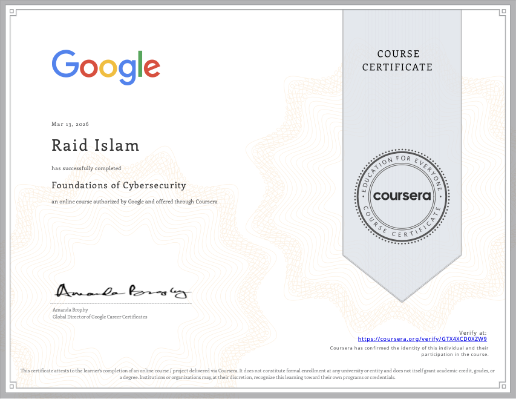

## ✅ Course 2 - Play It Safe: Manage Security Risks 
### Key Concepts
- Covered the NIST Cybersecurity Framework (CSF) five core functions: Identify, Protect, Detect, Respond, Recover
- Introduced risk management concepts including how to identify, assess, and prioritize risks
- Discussed security audits and their role in ensuring compliance with policies and regulations
- Covered common compliance frameworks including HIPAA, GDPR, and PCI-DSS and why organizations follow them
- Introduced SIEM tools as a way to collect and analyze security logs to detect threats
- Covered security playbooks and how SOC analysts use them to respond to incidents consistently
- Discussed the difference between threats, vulnerabilities, and risks and how they relate to each other
- Introduced basic incident response concepts including how analysts triage and prioritize security events

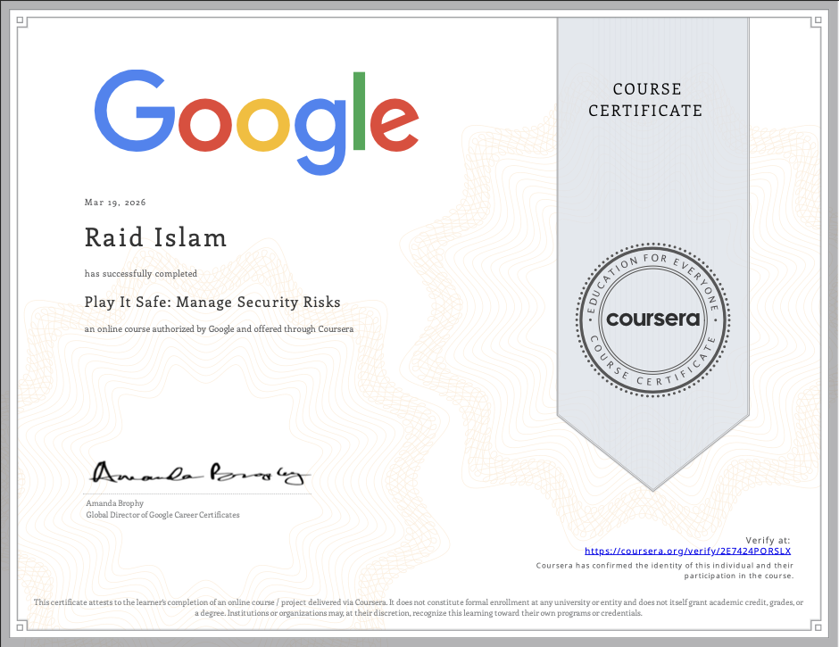

## ✅ Course 3 - Connect and Protect: Networks and Security 
### Key Concepts
- Covered how networks work including LAN, WAN, and the difference between them
- Introduced the TCP/IP model and how data travels across a network through layers
- Covered key networking protocols including TCP, UDP, HTTP, HTTPS, DNS, and FTP and what each does
- Discussed IP addressing including the difference between IPv4 and IPv6
- Introduced network security tools including firewalls, IDS, IPS, and how they protect network traffic
- Covered common network attacks including DDoS, packet sniffing, and man-in-the-middle attacks
- Discussed VPNs and how they encrypt traffic to protect data in transit
- Introduced the concept of network hardening including closing unnecessary ports and keeping systems patched

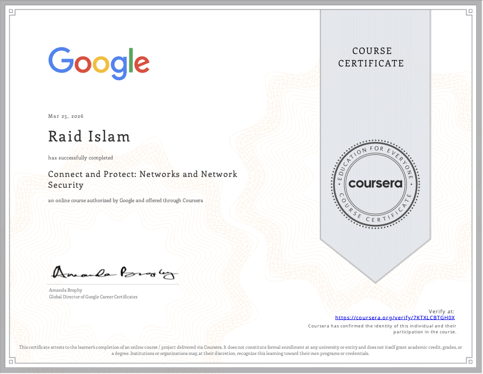

## ✅ Course 4 - Tools of the Trade: Linux and SQL 
### Key Concepts
- This course we go into learning and getting hands on expierence with the operating system
- The OS (operating system) we learn in this course is Linux, we learn the basic command lines in the bash shell

### Module 1 - Introduction to operating systems
- Learned about the different OS, like Windows, Linux, ChromeOS, Android, and IOS
- Also talked about how the user and computer interact with each other, it starts with the user then the application, then the OS, and then to the hardware. Once it reaches the hardware it goes into reverse order so the user gets that output
- Talked about GUI (Graphical User Interface) and CLI (Command Line Interface)

### Module 2 - The Linux operating system
- This module covered the architecture of Linux and how each layer interacts 
with the other. The structure goes from the user at the top, down through 
applications, the shell, the kernel, and finally the hardware. We also 
covered the Filesystem Hierarchy Standard (FHS) which defines how directories 
are organized in Linux.

- In our first hands-on lab we worked with the apt package manager to install 
and remove applications. We verified apt was installed, used it to install 
Suricata (a network security monitoring tool), confirmed the installation 
was successful, and then removed it afterwards.

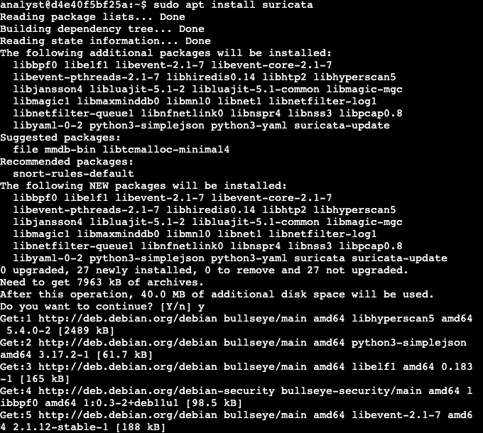
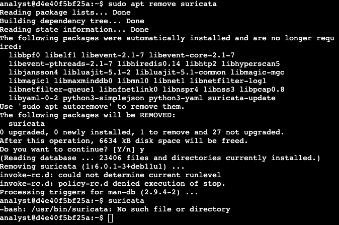

- We then practiced basic input commands in the shell. The echo command prints 
text back to the terminal, and expr performs mathematical calculations. These 
are foundational commands for writing bash scripts later on.

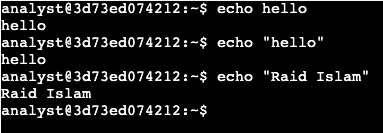
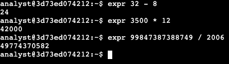

### Module 3 - Linux commands in the Bash shell
- In this lab we practiced navigating the Linux file system using core commands. Used pwd to check the current directory, ls to list contents, and cd to move between directories. We also used cat to read file contents and practiced writing absolute paths from the home directory.

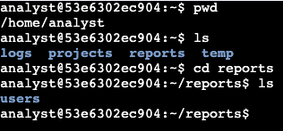
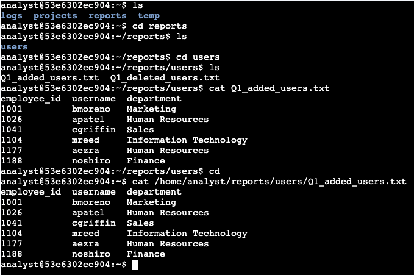

- We then covered filtering commands using grep to search for specific patterns inside files like finding the word "error" in server_logs.txt. Also used piping with the | symbol to chain commands together for more specific results.

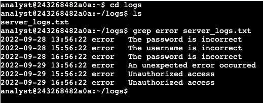
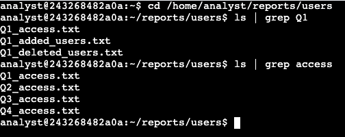
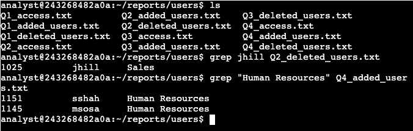

- In this lab we created and removed directories using mkdir and rmdir, and moved files between directories using the mv command. We then deleted a file called tempnotes.txt using rm and created a new file called tasks.txt using touch.Finally we edited tasks.txt using the nano text editor and verified the changes were saved using cat.

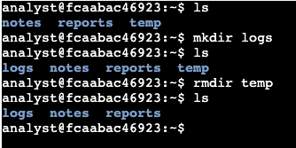
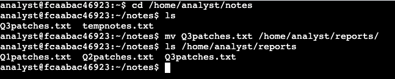
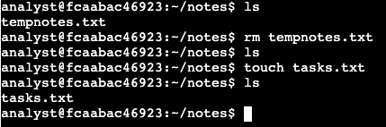
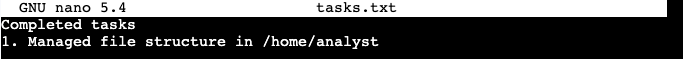
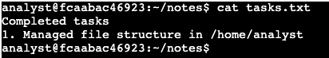

- In the next lab we worked with file permissions to control who has access to what. We used ls -l to view permissions on files inside the permissions directory, and ls -la to also reveal hidden files. After reviewing the permissions we used chmod to modify them, specifically using chmod o-w to remove the write permission from the owner on specific files.

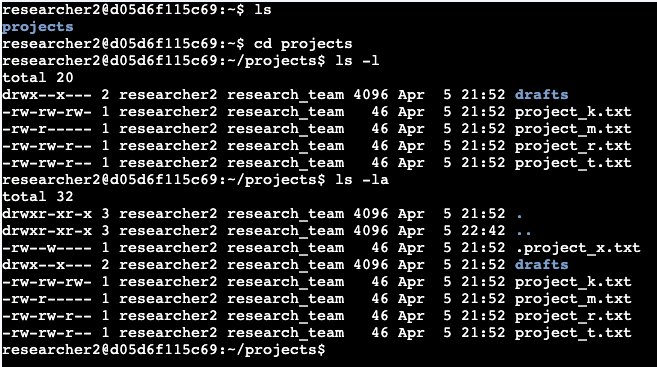
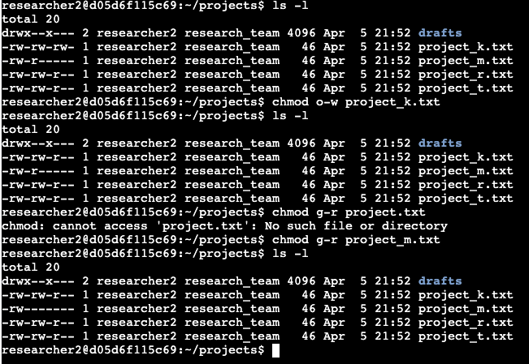
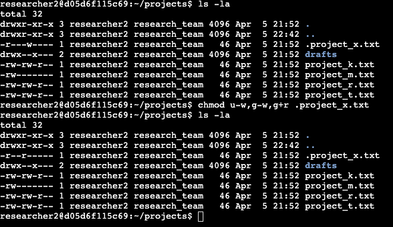

- In the next lab of this module we managed users and groups. We created a new user called researcher9 using sudo useradd, then added them to the research_team group using sudo usermod -g. We assigned file ownership of project_r.txt to that user using chown, and added them to a secondary group called sales_team. When deleting the user with userdel ran into an issue since the user wasn't in a primary group, so we used groupdel instead to remove the group.

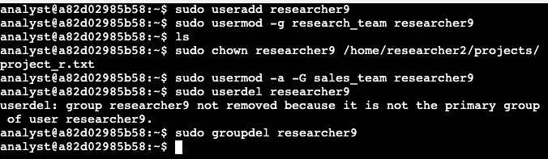

### Module 4 - Databases and SQL
- In our first lab of this module we start getting some first expierence with using SQL queries. We use SELECT to retrieve the columns and then FROM to retrieve the date from the table. For this instance we are getting records of the login date and login time and then using ORDER BY to have those at the top. 

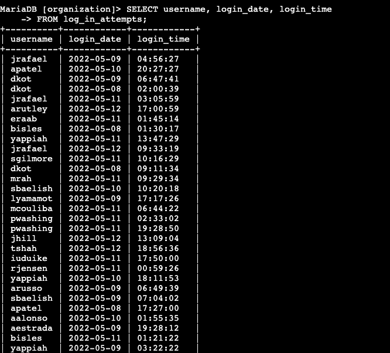
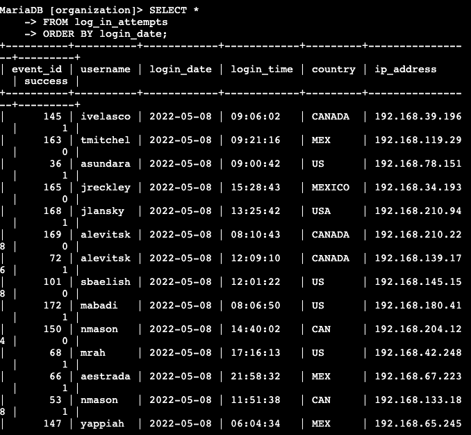
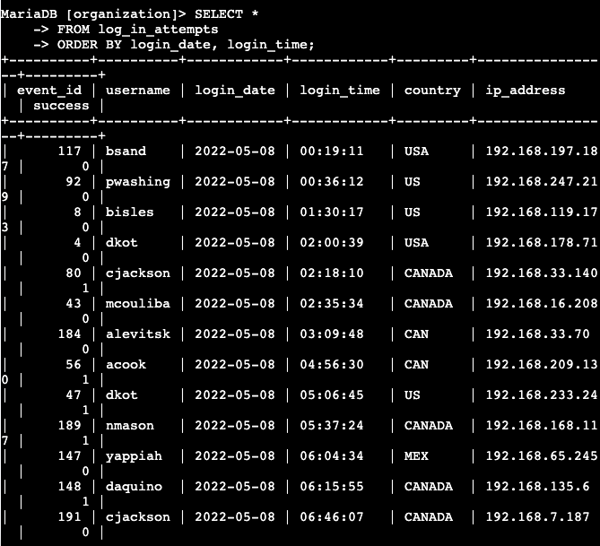

- In this next lab we work with the WHERE and LIKE operator for more specific filtering in SQL databases. We use WHERE to pull specific columns from the specific table in SQL and we use the LIKE operator to type in a word with a percentage symbol to find a matching pattern. 

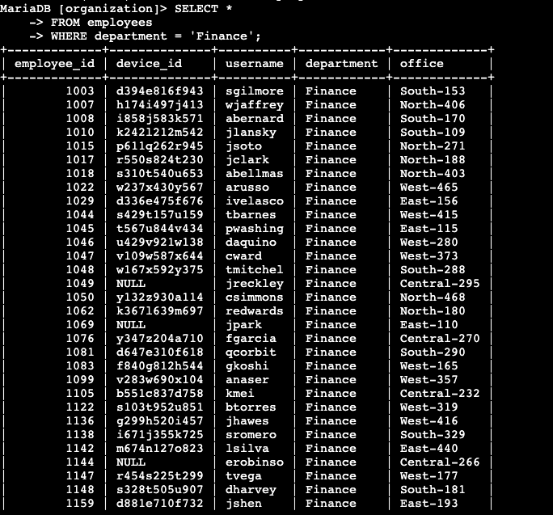
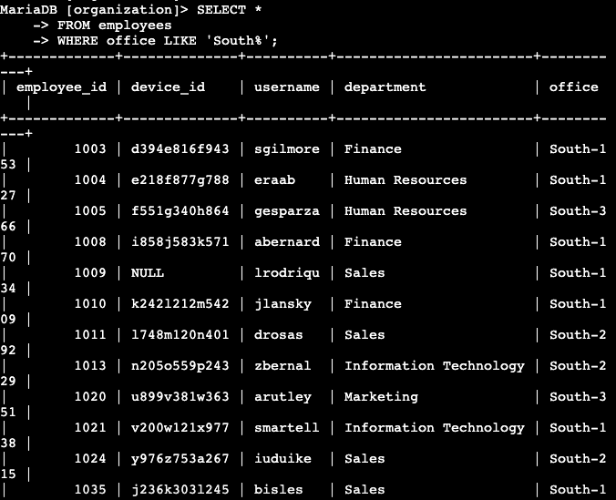

- This lab we focused on finding data with dates and times, either using a less then, greater than, or even less than and equal too or greater than and equal too symbols to determine data either after or before those times and and dates. We also used the BETWEEN operator to find data inbetween two times or dates to pull even more specific data from the tables. 

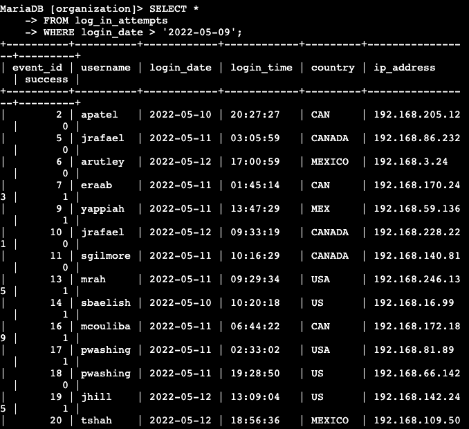
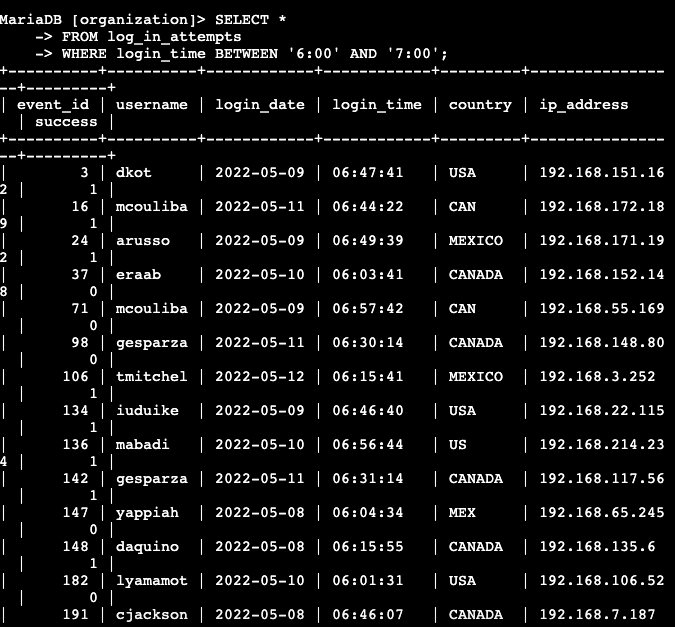

- Next lab we use the operators AND, OR, and NOT to filter out stuff even more specific data we need to find. Like finding failed login attempts before a specific time and to see if it actually failed and how many attempts where there. Or finding a specific department with a specific office and even excluding a department. 

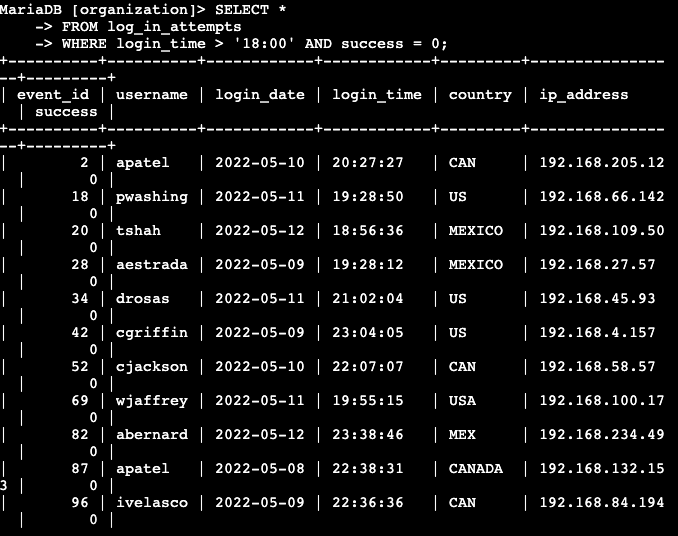
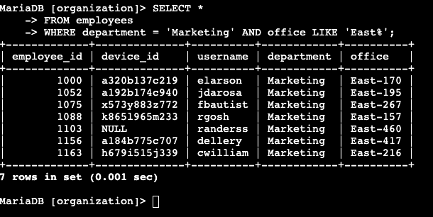
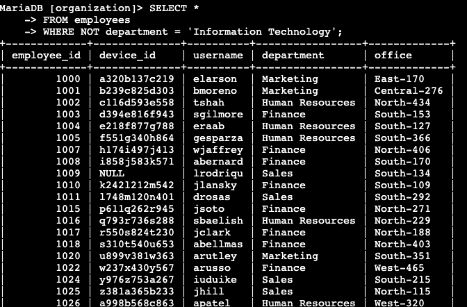

- In this final lab we use 3 forms of joining tables, the INNER JOIN, RIGHT JOIN, and LEFT JOIN, this lab didn't include the FULL OUTER JOIN but it wasn't needed for the scenario. 

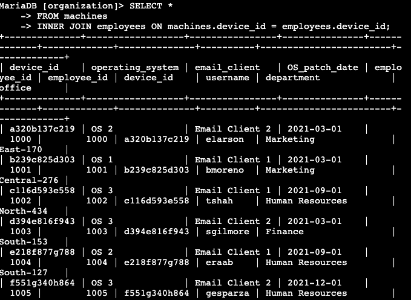
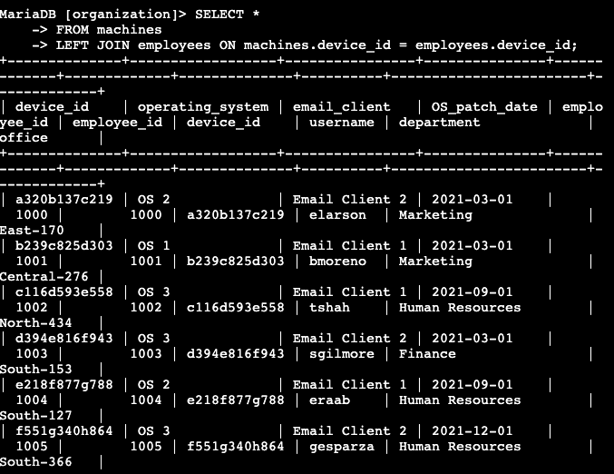
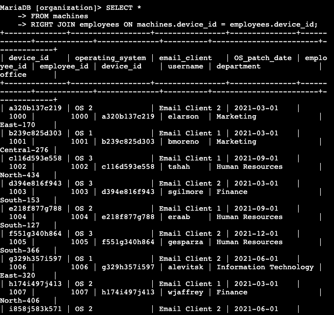

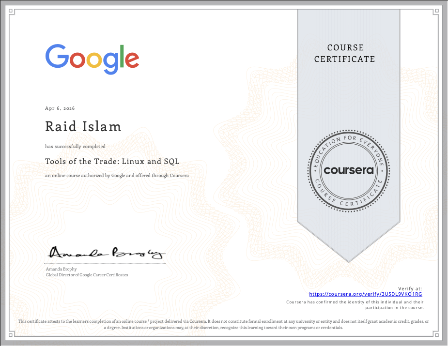

## Course 5 - Assets, Threats, and Vulnerabilities *(In Progress)*

### Module 1 - Introduction to Asset Security
- 