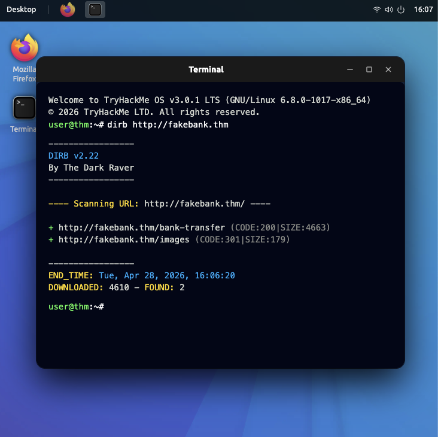

# TryHackMe - Pre-Security Path

## 🔄 Intro to Cyber Security

Key Skills: Web enumeration, directory discovery, SOC alert triage, 
threat identification

---

### Offensive Security — Web Directory Enumeration
Used dirb to scan a simulated banking website for hidden endpoints, 
discovering an exposed /bank-transfer page (HTTP 200) and an /images 
redirect (HTTP 301). This mirrors how attackers map a target's attack 
surface during reconnaissance — and what SOC analysts look for in 
web server logs.

---

### Defensive Security — SOC Alert Triage
Worked from a live Security Analyst Dashboard to investigate active 
alerts including a Web Discovery Attack, High severity port scanning 
from an external IP, a database enumeration attempt, and an SQL 
Injection alert. Practiced identifying source IPs and prioritizing 
alerts by severity — the core daily workflow of a Tier 1 SOC analyst.

---

**Key Takeaway:** Offensive techniques like directory enumeration and 
port scanning are exactly what SOC analysts monitor for on the 
defensive side. Understanding how attacks work makes you better at 
detecting them.

