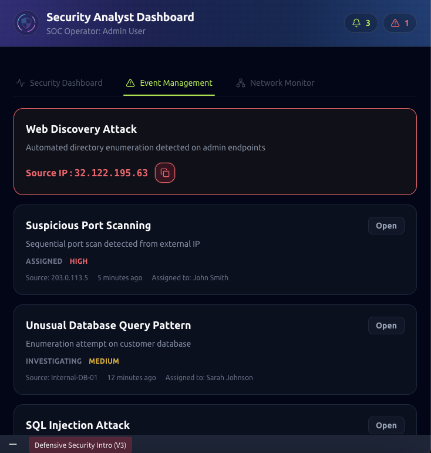
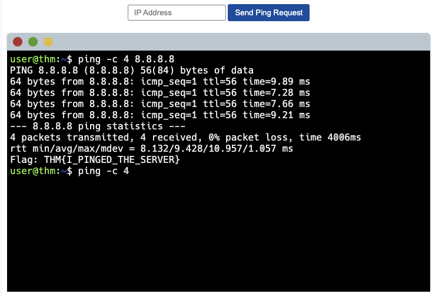
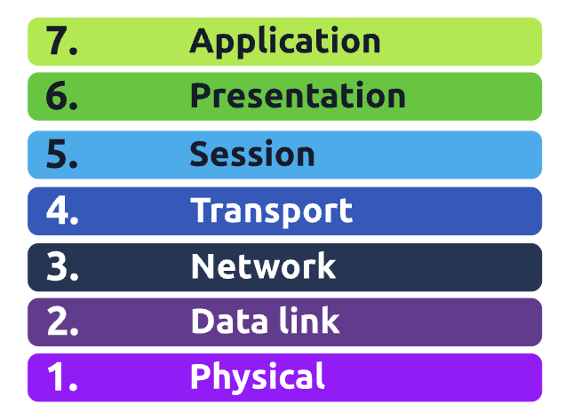

# TryHackMe - Pre-Security Path

## Intro to Cyber Security

Key Skills: Web enumeration, directory discovery, SOC alert triage, 
threat identification

---

### Offensive Security — Web Directory Enumeration
Used dirb to scan a simulated banking website for hidden endpoints, 
discovering an exposed /bank-transfer page (HTTP 200) and an /images 
redirect (HTTP 301). This mirrors how attackers map a target's attack 
surface during reconnaissance — and what SOC analysts look for in 
web server logs.

---

### Defensive Security — SOC Alert Triage
Worked from a live Security Analyst Dashboard to investigate active 
alerts including a Web Discovery Attack, High severity port scanning 
from an external IP, a database enumeration attempt, and an SQL 
Injection alert. Practiced identifying source IPs and prioritizing 
alerts by severity — the core daily workflow of a Tier 1 SOC analyst.

---

**Key Takeaway:** Offensive techniques like directory enumeration and 
port scanning are exactly what SOC analysts monitor for on the 
defensive side. Understanding how attacks work makes you better at 
detecting them.

## Pre-Security — Network Fundamentals

Key Skills: IP addressing, MAC addresses, OSI model, TCP/UDP protocols,
port identification, network devices, VPNs, firewalls

---

### Network Basics — IP, MAC, Switches & Routers

Every device on a network needs a way to be identified and reached.
IP addresses handle logical addressing while MAC addresses handle
physical addressing — both are essential for getting data to the
right place.

**IP Addressing (IPv4):**
IPv4 addresses contain 4 octets, each ranging from 0-255.
- Valid: 192.168.1.1
- Invalid: 256.123.1.9 — exceeds the 0-255 range

**MAC Addresses:**
The physical address used for network communication. Split into two halves:
- First half: vendor/manufacturer signature (e.g. a4:c3:f0)
- Second half: unique address of the network interface (e.g. 85:ac:2d)

**Network Devices:**
- Switches — connect multiple devices on the same network (computers,
printers, etc.), used for larger local networks
- Routers — connect separate networks together and pass data between them

**Ping Command:**
The ping command tests how long it takes to send a packet from a source
to a destination device, measured in milliseconds. Used to check
latency and connectivity between devices.

---

### The OSI Model

The OSI model is a framework that shows how network devices send,
receive, and interpret data across 7 layers. Each layer has a
specific role in moving data from one device to another.

1. **Physical** — the actual hardware used in networking
2. **Data Link** — physical addressing, assigns MAC addresses to transmissions
3. **Network** — determines the most optimal path for data to travel
4. **Transport** — transmits data across the network using TCP or UDP
5. **Session** — maintains active connections between devices
6. **Presentation** — translates data so both sender and receiver
can understand the format
7. **Application** — sets protocols and rules for how users interact
with sent or received data

---

### Packets and Frames

Packets and frames work similarly to mailing a letter — the frame
is the envelope that moves the contents, and the packet is the
actual information inside.

**Packet Header contains:**
- TTL (Time to Live) — limits how long a packet can travel
- Checksum — verifies data integrity, corruption occurs if altered
- Source Address — where the packet came from
- Destination Address — where the packet is going

---

### TCP/IP and the Three-Way Handshake

TCP (Transmission Control Protocol) uses a 4-layer model and
requires an established connection before any data is sent.

**TCP/IP Layers:**
- Application
- Transport
- Internet
- Network Interface

**TCP Header contains:**
Source Port, Destination Port, Source IP, Destination IP,
Sequence Number, Acknowledgement Number, Checksum, Data, Flag

**The Three-Way Handshake** is the process TCP uses to establish
a connection between two devices:
- **SYN** — client sends initial packet to sync with the server
- **SYN/ACK** — server acknowledges the sync attempt
- **ACK** — client confirms receipt, connection is established
- **DATA** — data transfer begins
- **FIN** — connection closes after completion
- **RST** — connection terminates immediately if a problem is found

**Why this matters for SOC work:** Unusual handshake patterns like
a flood of SYN packets with no ACK response is a classic indicator
of a SYN flood DDoS attack which is something SOC analysts actively monitor
for in network traffic. 

---

### UDP (User Datagram Protocol)

UDP communicates like TCP but without requiring a constant connection
— no three-way handshake. This makes it faster but less reliable.

**UDP Header contains:**
Source Address, Destination Address, Source Port, Destination Port, Data

**When UDP is used:** DNS lookups, video streaming, online gaming —
situations where speed matters more than guaranteed delivery.

---

### Ports

Ports range from 0-65,535 and are the specific channels through
which all data is sent and received. Every service runs on a
designated port.

**Key ports to know:**
| Port | Protocol | Use |
|------|----------|-----|
| 21 | FTP | File Transfer Protocol |
| 22 | SSH | Secure Shell — encrypted remote access |
| 80 | HTTP | Web traffic — unencrypted |
| 443 | HTTPS | Web traffic — encrypted |
| 445 | SMB | Server Message Block — file sharing |
| 3389 | RDP | Remote Desktop Protocol |

**SOC relevance:** Seeing traffic on unexpected ports or unusual
activity on known ports like RDP (3389) from an external IP is
a common alert trigger that analysts investigate daily.

---

### Extending Your Network

**Port Forwarding** — connects applications and services to the
internet, configured at the router level. Misconfigured port
forwarding is a common attack vector.

**Firewalls** — act as traffic controllers within a network,
permitting or denying traffic based on rules set by an admin:
- **Stateful** — tracks active connections and makes decisions
based on the context of traffic
- **Stateless** — applies rules to each packet individually
without tracking connection state

**VPN (Virtual Private Network)** — allows devices on separate
networks to communicate securely by encrypting traffic between them.

**Routing** — creates paths between networks so data can be
delivered to the correct destination.

**VLAN (Virtual Local Area Network)** — allows specific devices
within a network to be logically separated into subsections,
improving security and reducing broadcast traffic.

## Pre-Security - How the Web Works 