# TryHackMe - Pre-Security Path

## Intro to Cyber Security

Key Skills: Web enumeration, directory discovery, SOC alert triage, 
threat identification

---

### Offensive Security — Web Directory Enumeration
Used dirb to scan a simulated banking website for hidden endpoints, 
discovering an exposed /bank-transfer page (HTTP 200) and an /images 
redirect (HTTP 301). This mirrors how attackers map a target's attack 
surface during reconnaissance — and what SOC analysts look for in 
web server logs.

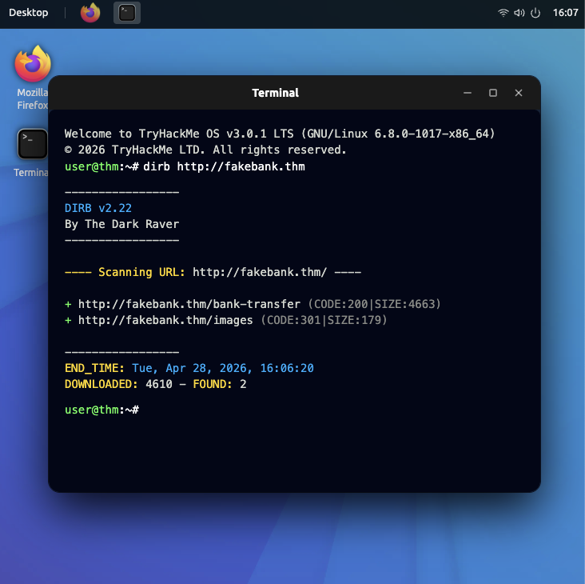

---

### Defensive Security — SOC Alert Triage
Worked from a live Security Analyst Dashboard to investigate active 
alerts including a Web Discovery Attack, High severity port scanning 
from an external IP, a database enumeration attempt, and an SQL 
Injection alert. Practiced identifying source IPs and prioritizing 
alerts by severity — the core daily workflow of a Tier 1 SOC analyst.

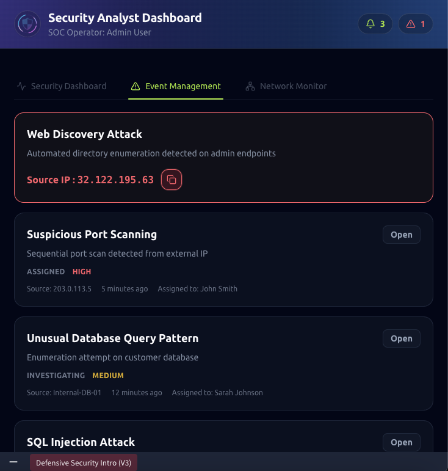

---

**Key Takeaway:** Offensive techniques like directory enumeration and 
port scanning are exactly what SOC analysts monitor for on the 
defensive side. Understanding how attacks work makes you better at 
detecting them.

## Pre-Security — Network Fundamentals

Key Skills: IP addressing, MAC addresses, OSI model, TCP/UDP protocols,
port identification, network devices, VPNs, firewalls

---

### Network Basics — IP, MAC, Switches & Routers

Every device on a network needs a way to be identified and reached.
IP addresses handle logical addressing while MAC addresses handle
physical addressing — both are essential for getting data to the
right place.

**IP Addressing (IPv4):**
IPv4 addresses contain 4 octets, each ranging from 0-255.
- Valid: 192.168.1.1
- Invalid: 256.123.1.9 — exceeds the 0-255 range

**MAC Addresses:**
The physical address used for network communication. Split into two halves:
- First half: vendor/manufacturer signature (e.g. a4:c3:f0)
- Second half: unique address of the network interface (e.g. 85:ac:2d)

**Network Devices:**
- Switches — connect multiple devices on the same network (computers,
printers, etc.), used for larger local networks
- Routers — connect separate networks together and pass data between them

**Ping Command:**
The ping command tests how long it takes to send a packet from a source
to a destination device, measured in milliseconds. Used to check
latency and connectivity between devices.

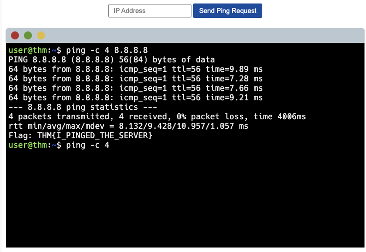

---

### The OSI Model

The OSI model is a framework that shows how network devices send,
receive, and interpret data across 7 layers. Each layer has a
specific role in moving data from one device to another.

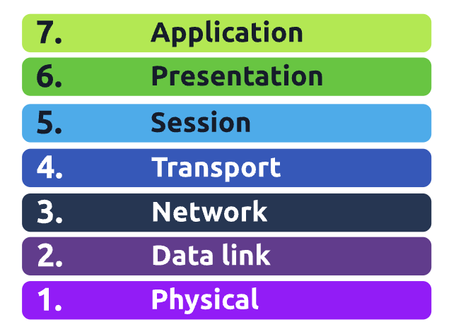

1. **Physical** — the actual hardware used in networking
2. **Data Link** — physical addressing, assigns MAC addresses to transmissions
3. **Network** — determines the most optimal path for data to travel
4. **Transport** — transmits data across the network using TCP or UDP
5. **Session** — maintains active connections between devices
6. **Presentation** — translates data so both sender and receiver
can understand the format
7. **Application** — sets protocols and rules for how users interact
with sent or received data

---

### Packets and Frames

Packets and frames work similarly to mailing a letter — the frame
is the envelope that moves the contents, and the packet is the
actual information inside.

**Packet Header contains:**
- TTL (Time to Live) — limits how long a packet can travel
- Checksum — verifies data integrity, corruption occurs if altered
- Source Address — where the packet came from
- Destination Address — where the packet is going

---

### TCP/IP and the Three-Way Handshake

TCP (Transmission Control Protocol) uses a 4-layer model and
requires an established connection before any data is sent.

**TCP/IP Layers:**
- Application
- Transport
- Internet
- Network Interface

**TCP Header contains:**
Source Port, Destination Port, Source IP, Destination IP,
Sequence Number, Acknowledgement Number, Checksum, Data, Flag

**The Three-Way Handshake** is the process TCP uses to establish
a connection between two devices:
- **SYN** — client sends initial packet to sync with the server
- **SYN/ACK** — server acknowledges the sync attempt
- **ACK** — client confirms receipt, connection is established
- **DATA** — data transfer begins
- **FIN** — connection closes after completion
- **RST** — connection terminates immediately if a problem is found

**Why this matters for SOC work:** Unusual handshake patterns like
a flood of SYN packets with no ACK response is a classic indicator
of a SYN flood DDoS attack which is something SOC analysts actively monitor
for in network traffic. 

---

### UDP (User Datagram Protocol)

UDP communicates like TCP but without requiring a constant connection
— no three-way handshake. This makes it faster but less reliable.

**UDP Header contains:**
Source Address, Destination Address, Source Port, Destination Port, Data

**When UDP is used:** DNS lookups, video streaming, online gaming —
situations where speed matters more than guaranteed delivery.

---

### Ports

Ports range from 0-65,535 and are the specific channels through
which all data is sent and received. Every service runs on a
designated port.

**Key ports to know:**
| Port | Protocol | Use |
|------|----------|-----|
| 21 | FTP | File Transfer Protocol |
| 22 | SSH | Secure Shell — encrypted remote access |
| 80 | HTTP | Web traffic — unencrypted |
| 443 | HTTPS | Web traffic — encrypted |
| 445 | SMB | Server Message Block — file sharing |
| 3389 | RDP | Remote Desktop Protocol |

**SOC relevance:** Seeing traffic on unexpected ports or unusual
activity on known ports like RDP (3389) from an external IP is
a common alert trigger that analysts investigate daily.

---

### Extending Your Network

**Port Forwarding** — connects applications and services to the
internet, configured at the router level. Misconfigured port
forwarding is a common attack vector.

**Firewalls** — act as traffic controllers within a network,
permitting or denying traffic based on rules set by an admin:
- **Stateful** — tracks active connections and makes decisions
based on the context of traffic
- **Stateless** — applies rules to each packet individually
without tracking connection state

**VPN (Virtual Private Network)** — allows devices on separate
networks to communicate securely by encrypting traffic between them.

**Routing** — creates paths between networks so data can be
delivered to the correct destination.

**VLAN (Virtual Local Area Network)** — allows specific devices
within a network to be logically separated into subsections,
improving security and reducing broadcast traffic.

## How The Web Works

Key Skills: DNS resolution, HTTP methods, URL structure, 
web technologies, status codes

---

### DNS and Domain Hierarchy

When you type a website into your browser the DNS system acts as 
the internet's phone book — translating human readable domain names 
into IP addresses that computers can actually use.

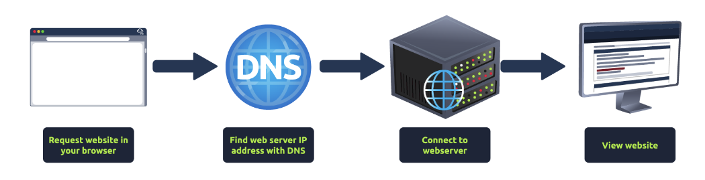

**Domain Hierarchy:**
- **TLD (Top Level Domain)** — the far right part of a domain 
like .com, .org, or .gov. Each TLD has its own registry managing 
which domains can be registered under it
- **Second Level Domain** — the recognizable part of the domain 
like "google" in google.com, limited to 63 characters
- **Subdomain** — sits to the left of the second level domain 
like "shop" in shop.google.com, used to organize different 
sections of a website

**DNS Record Types:**
- **A Record** — maps a domain to an IPv4 address
- **AAAA Record** — maps a domain to an IPv6 address
- **CNAME Record** — maps a domain to another domain name 
rather than an IP address, commonly used for subdomains
- **MX Record** — directs email to the correct mail server 
for a domain
- **TXT Record** — stores arbitrary text data, commonly used 
for domain verification and email security configurations

**Lab — DNS Record Lookup with nslookup:**
Used nslookup to query different DNS record types for a target 
domain. Queried CNAME records to find that shop.website.thm 
pointed to shops.myshopify.com, TXT records to retrieve hidden 
text data, MX records to identify the mail server, and A records 
to resolve a subdomain to its IP address. This mirrors how SOC 
analysts investigate suspicious domains during threat intelligence 
work.

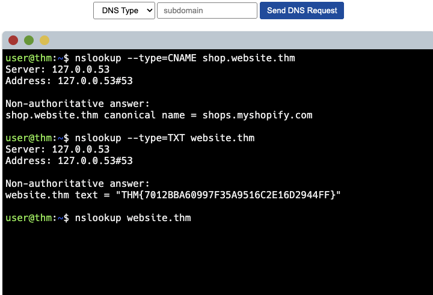
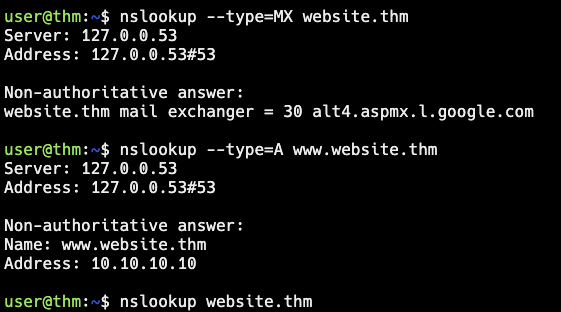

---

### HTTP, URLs, and Web Methods

HTTP (HyperText Transfer Protocol) is the set of rules used to 
communicate data across the web. Every time you load a webpage 
your browser is making HTTP requests and receiving responses.

**Anatomy of a URL:**
A URL contains several components that tell the browser exactly 
where to go and what to do.

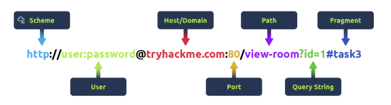

- **Scheme** — the protocol being used (http or https)
- **User** — optional credentials passed in the URL
- **Host/Domain** — the website address
- **Port** — the port to connect to (defaults to 80 for HTTP, 
443 for HTTPS)
- **Path** — the specific page or resource being requested
- **Query String** — additional data sent to the server 
(e.g. ?id=1)
- **Fragment** — references a specific section within the page

**HTTP Methods:**
- **GET** — retrieves data from a server without modifying it. 
Used every time you load a webpage or request a resource
- **POST** — sends data to a server to create something new, 
like submitting a login form or creating an account
- **PUT** — sends data to a server to update an existing 
resource
- **DELETE** — removes a resource from the server

**HTTP Status Codes:**
- **200 OK** — request succeeded
- **201 Created** — resource successfully created
- **301 Moved Permanently** — resource has permanently moved 
to a new URL
- **302 Found** — temporary redirect
- **404 Not Found** — resource doesn't exist
- **403 Forbidden** — no permission to access the resource
- **500 Internal Server Error** — server side error

**Lab — HTTP Methods in Practice:**
Practiced making GET, POST, and PUT requests to a simulated 
web server and analyzed the request and response headers. 

A GET request to /room returned a 200 response with HTML 
content confirming successful retrieval.

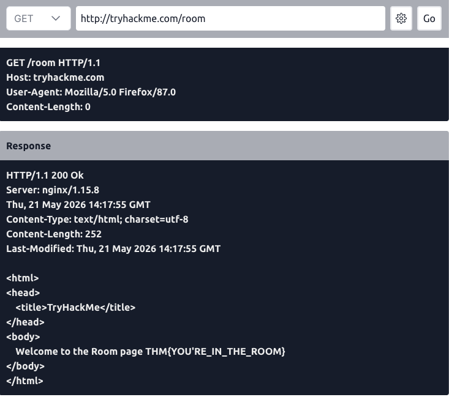

A POST request to /login submitted credentials in the request 
body and returned a 200 response confirming successful 
authentication. This demonstrates how login forms transmit 
data and why POST is used instead of GET for sensitive 
information — GET requests append data to the URL which 
would expose credentials in plaintext.

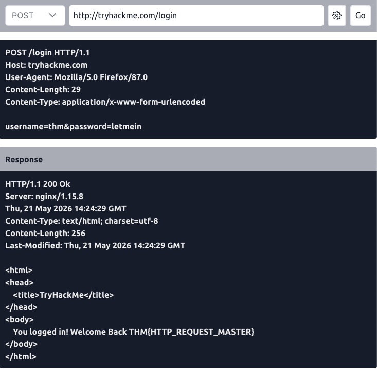

A PUT request to /user/2 updated a username to admin and 
returned a 200 confirmation. This demonstrates how attackers 
can abuse unsecured PUT endpoints to escalate privileges — 
a common web application vulnerability.

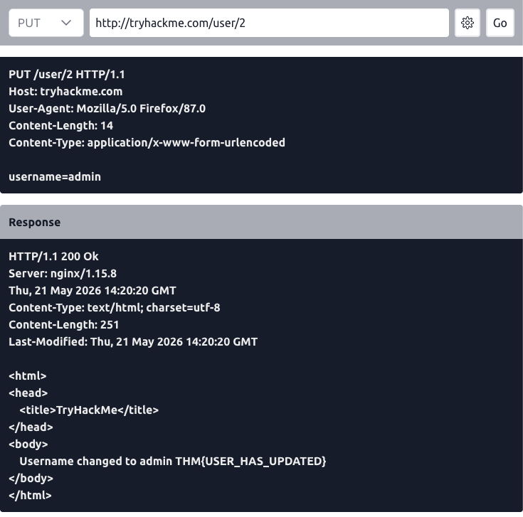
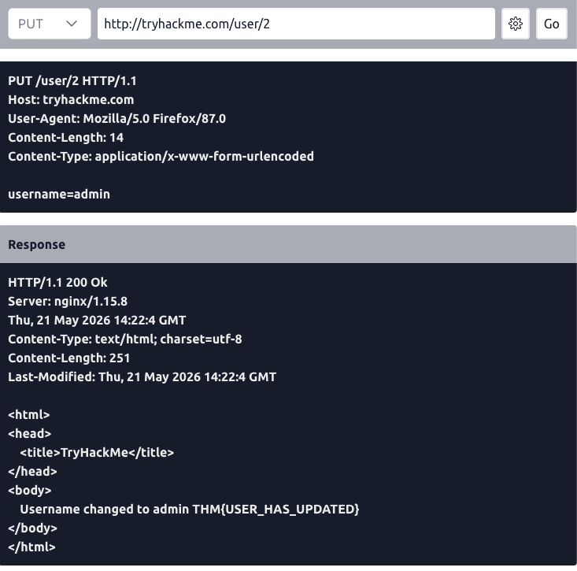

Used browser developer tools to inspect live HTTP GET requests 
and response headers on a locally hosted web application, 
identifying status codes, content types, file sizes, and 
load times for each resource.

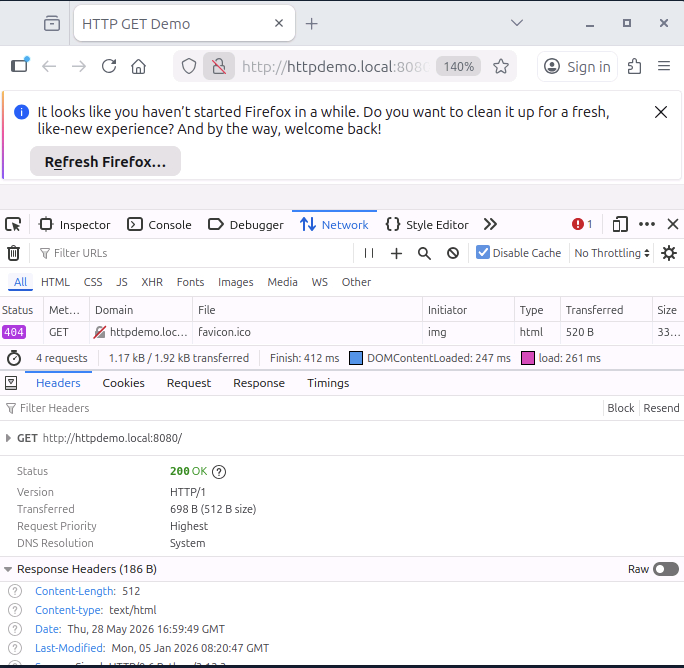
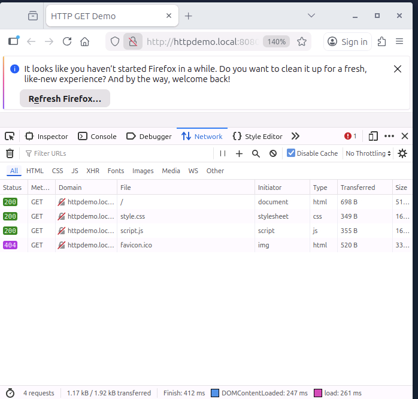

---

### Web Technologies — HTML, CSS, JavaScript

Websites are built from three core technologies that work 
together to create what users see and interact with.

- **HTML** — the structure and content of a webpage. Every 
element like headings, paragraphs, images, and forms is 
defined in HTML
- **CSS** — controls the visual styling and layout. Colors, 
fonts, spacing, and positioning are all CSS
- **JavaScript** — adds interactivity and dynamic behavior. 
Form validation, animations, and real-time updates are 
handled by JavaScript

**Lab — HTML and Source Code Analysis:**
Practiced writing basic HTML structure and rendering it in 
the browser. Also inspected the source code of a vulnerable 
website and discovered credentials left in an HTML comment 
by a developer — a classic information disclosure 
vulnerability that SOC analysts and penetration testers 
actively look for during web application assessments.

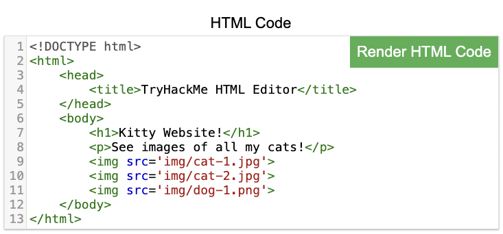
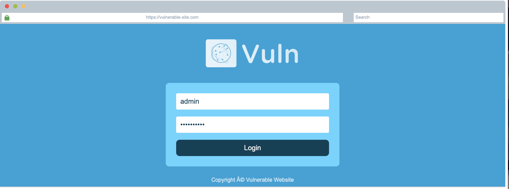
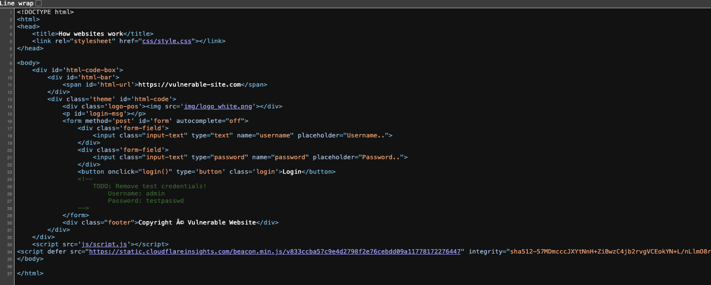

**SOC relevance:** Developers accidentally leaving credentials, 
API keys, or sensitive information in HTML comments or 
JavaScript files is a real and common vulnerability. During 
incident investigations analysts often review page source 
to identify information that shouldn't be publicly visible.

---

## Computer Fundamentals

Key Skills: Computer hardware components, boot process, 
client-server model, virtualization

---

### Computer Hardware and the Boot Process

Understanding what's inside a computer and how it starts up 
is foundational knowledge for anyone working in IT or security.

**Core Hardware Components:**
- **Motherboard** — the main circuit board connecting all 
components together
- **CPU** — the brain of the computer, processes all 
instructions
- **RAM** — temporary memory that stores data actively 
being used
- **GPU** — handles graphics processing
- **SSD/HDD** — permanent storage for the operating system, 
files, and applications
- **PSU** — converts power from the wall outlet to usable 
power for components
- **I/O** — input/output interfaces like USB ports, display 
outputs, and network interfaces

**What Happens When You Press Start:**
1. Power button sends signal to PSU
2. Firmware (BIOS/UEFI) initializes and starts
3. POST (Power-On Self Test) checks that hardware is working
4. Boot device is selected based on boot order
5. Bootloader starts and loads the operating system

**SOC relevance:** Understanding the boot process matters 
for security because attacks like bootkits and rootkits 
target the firmware and bootloader stages specifically 
because they execute before the operating system and 
security tools load — making them extremely difficult 
to detect.

---

### Client-Server Model

The client-server model is the foundation of how virtually 
every networked application works — from websites to 
corporate internal tools.

**Key Concepts:**
- **Client** — the device or application requesting a service
- **Server** — the device or application providing the service
- **Request** — the message a client sends to a server 
asking for something
- **Response** — the server's reply containing the requested 
data or a status
- **Protocol** — the agreed set of rules governing how 
client and server communicate
- **Port** — the specific channel through which the 
communication occurs
- **DNS** — translates domain names to IP addresses so the 
client can find the server

**GET Method deep dive:**
Every webpage load starts with a GET request. The client 
sends a request including the path, host, and user agent. 
The server responds with a status code and the requested 
content. Understanding this flow is essential for analyzing 
web traffic in Wireshark or a SIEM.

---

## Operating Systems Basics 

Key Skills: OS types, kernel vs user space, Windows and 
Linux environments, virtualization

---

### Operating System Types

An operating system manages hardware resources and provides 
a platform for applications to run. Different environments 
require different types of operating systems.

- **Desktop OS** — designed for personal computers with 
a graphical user interface. Examples: Windows, macOS, 
Ubuntu Desktop
- **Server OS** — optimized for reliability, performance, 
and running services continuously without a GUI. 
Examples: Windows Server, Ubuntu Server, Red Hat 
Enterprise Linux
- **Mobile OS** — designed for touchscreen devices with 
limited resources. Examples: Android, iOS
- **Embedded OS** — runs on specialized hardware with 
a single dedicated function. Examples: firmware in 
routers, smart TVs, industrial controllers
- **Virtual/Cloud OS** — runs as a virtual machine on 
shared physical hardware, enabling multiple isolated 
environments on one physical server

**SOC relevance:** Most enterprise environments run a mix 
of all of these. SOC analysts need to understand each type 
because the logs, vulnerabilities, and attack surfaces 
differ significantly across operating system categories.

---

### Kernel Space vs User Space

The operating system divides its operations into two 
protected areas:

- **Kernel Space** — the core of the operating system 
where privileged operations happen. The kernel directly 
controls hardware, memory management, and process 
scheduling. Code running here has unrestricted access 
to system resources — which is why kernel-level malware 
like rootkits are so dangerous
- **User Space** — where all user applications run. 
Programs here have restricted access and must request 
kernel resources through system calls. Crashes in user 
space are contained — crashes in kernel space bring 
down the entire system

**SOC relevance:** Understanding this distinction matters 
for malware analysis. Rootkits that operate in kernel 
space are significantly more dangerous and harder to 
detect than user space malware because they can hide 
their presence from security tools running at the 
user level.

---

### Labs — Windows and Linux Environments

**Windows VM Lab:**
Accessed a Windows 10 environment and explored core 
built-in security and system tools including Windows 
Security, Windows Defender, Task Manager, Control Panel, 
and system information. Getting comfortable navigating 
Windows as an operating environment is essential since 
most enterprise SOC environments are Windows-based.

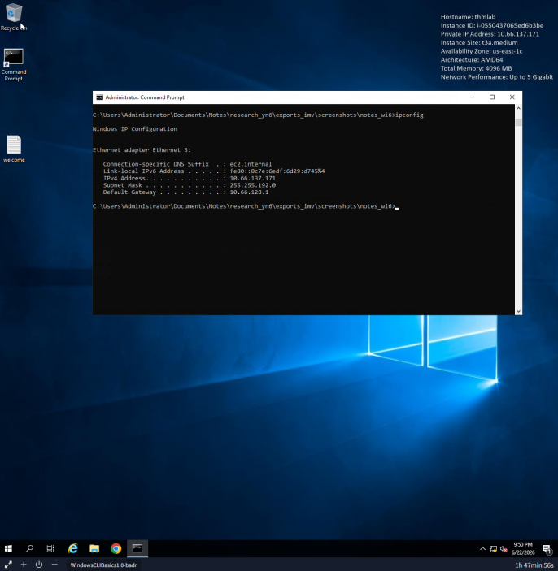

**Virtualization Manager Lab:**
Explored a virtualization management interface showing 
multiple virtual machines in different states like running, 
stopped, and provisioned. Managed VM lifecycle including 
provisioning, starting, stopping, and monitoring resource 
allocation across CPU, memory, and disk. Understanding 
virtualization is increasingly important for SOC analysts 
as enterprise environments move workloads to virtual 
and cloud infrastructure.

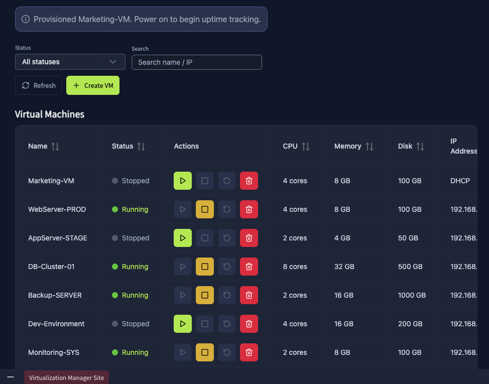

**Switching Users Ubuntu Lab:**
In this lab we began with root access and practiced switching
between user accounts. We identified weak credentials on the sammie 
account through manual password guessing using commonly used and 
insecure password patterns. After gaining access we reviewed the 
command history to recover the root password which demonstrates how 
poor password hygiene and unsanitized command histories can expose 
privileged credentials to attackers.

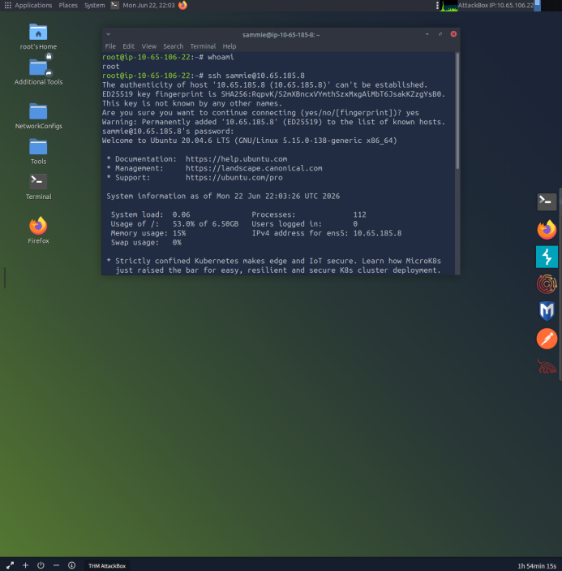

---

## Software Basics

Key Skills: Data representation, encoding standards, Python scripting,
JavaScript fundamentals, SQL querying

---

### Data Representation and Encoding

Computers store and transmit everything as numbers. This section
covered how data is represented at the binary level and how
encoding standards allow those numbers to be interpreted as
human-readable characters. 

**Binary and Hexadecimal** These are the two foundational number systems
used in computing. Binary (base-2) is how data is physically stored
at the hardware level. Hexadecimal (base-16) is used as a more
human-readable shorthand for binary values, which is commonly seen in
memory addresses, color codes, and network packet analysis.

**Character Encoding** is how characters are assigned to numeric
values so computers can store and transmit text:
- **ASCII** — one of the earliest encoding standards, mapping
128 characters including English letters, digits, punctuation,
and control characters to numeric values
- **UTF-8, UTF-16, UTF-32** — modern Unicode encoding standards
that extend beyond ASCII to support virtually every character
and symbol across all languages using variable byte lengths

**SOC relevance:** Understanding encoding is directly applicable
to security work since attackers frequently use encoding techniques
like Base64 or hex encoding to obfuscate malicious payloads
and evade detection. Recognizing encoded data in logs and
network traffic is a core analyst skill.

---

### Python — Number Guesser Script

Practiced Python fundamentals by reviewing an interactive number
guessing script. The program generates a target number and
provides directional hints such as higher or lower, until the user
guesses correctly. This exercise reinforced conditional logic,
user input handling, and control flow in Python.

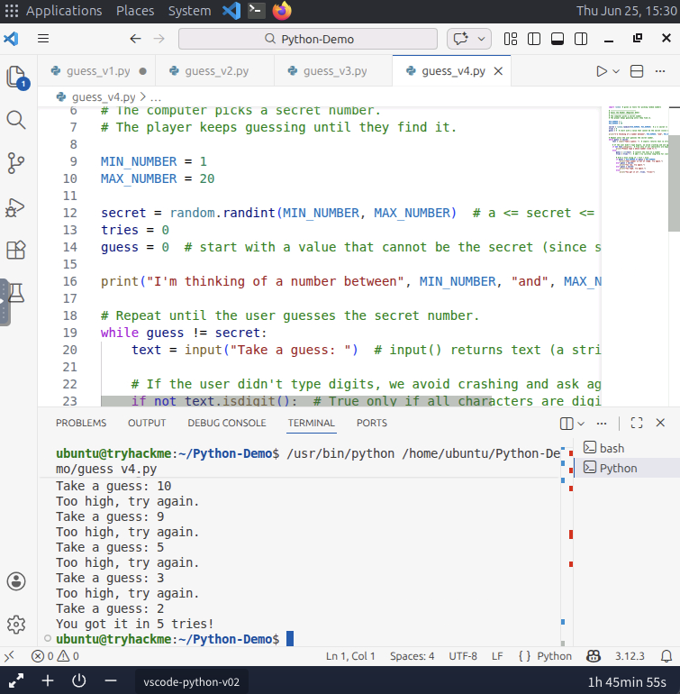

---

### JavaScript — Interactive Demo

The same number guessing logic in JavaScript as a demo to
understand how the same programming concepts translate across
languages. JavaScript runs client-side in the browser making
it the primary language for web application interactivity 
and one of the most common attack surfaces in web security
through vulnerabilities like XSS.

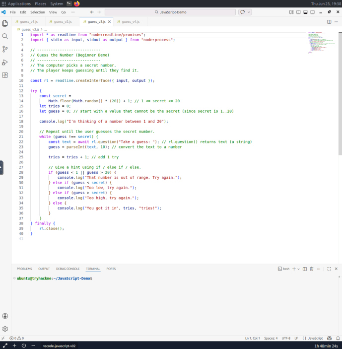

---

### SQL — Database Querying Lab

Practiced writing SQL queries against a simulated coffee shop
database to retrieve and filter data across multiple tables.
Worked through progressively complex queries using SELECT,
WHERE, JOIN, and filtering conditions to extract specific
records from the menu database.

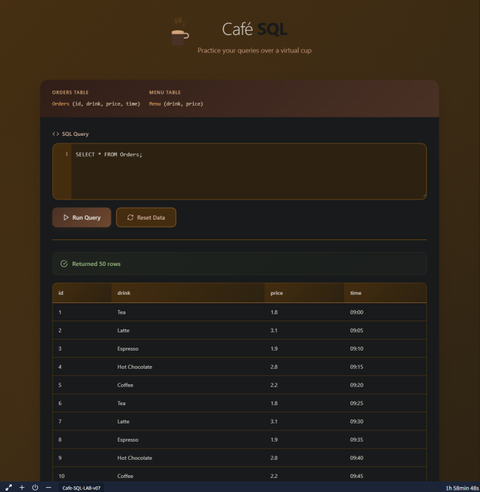
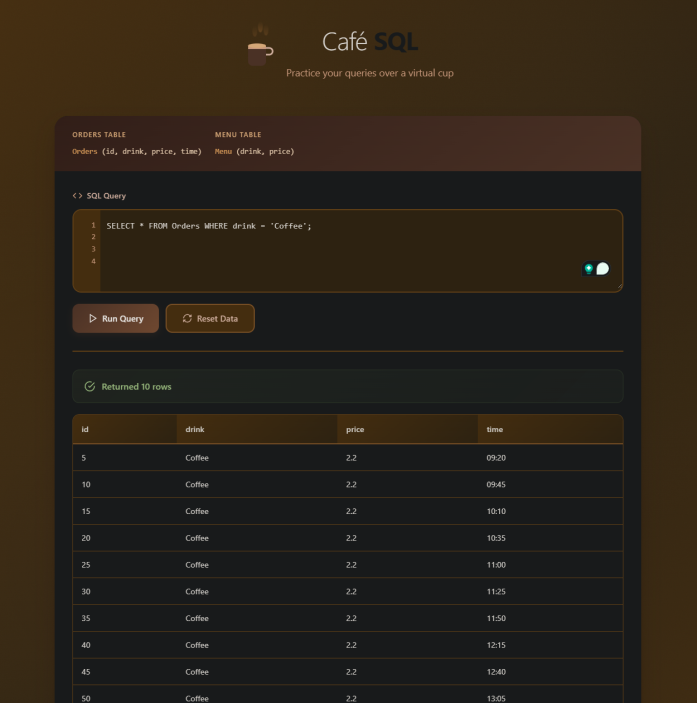
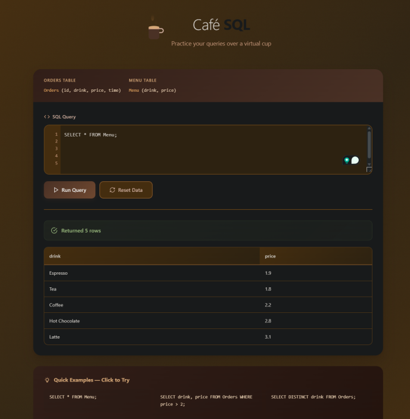
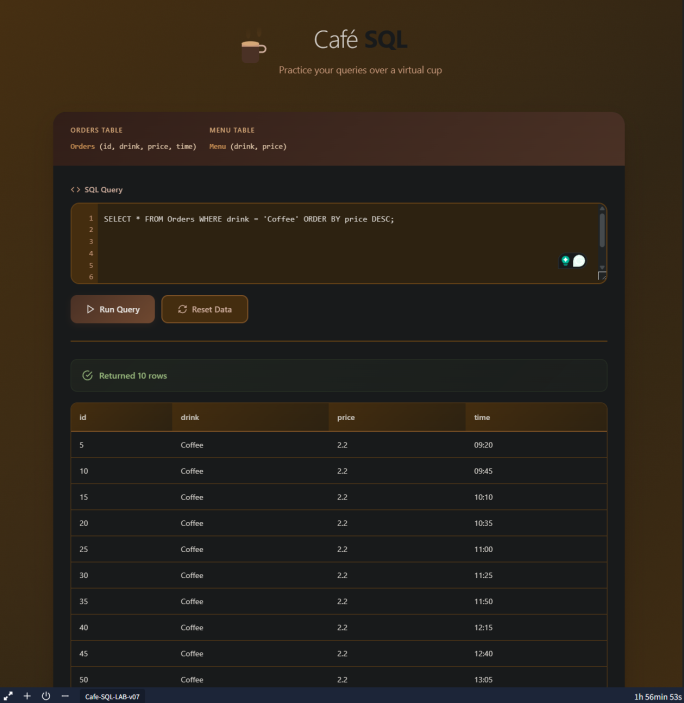

**SOC relevance:** SQL knowledge is directly applicable to
security work since SIEM platforms use query languages built on
SQL like syntax, and understanding how databases are structured
helps analysts investigate SQL injection attacks and query
security logs stored in relational databases.

---

## Attacks and Defenses